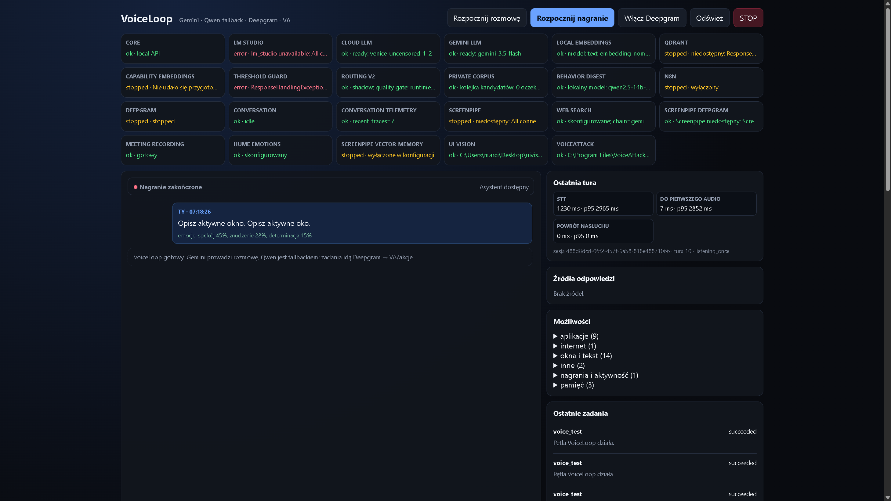
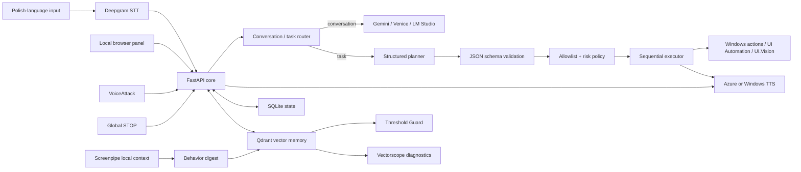

# VoiceLoop

**A local-first, Polish-language voice and context assistant for Windows, built
around one strict rule: the language model proposes, local code decides.**

[](https://github.com/marcinromanowskilublin/VoiceLoop/actions/workflows/ci.yml)

VoiceLoop is not another "LLM with tools" demo. The model never gets a shell,
never invents a tool, and never executes anything on its own. It returns a typed
plan; local code validates every step against an allowlist, a risk policy, and a
dependency graph — and rejects the **whole plan** if a single step fails.



*The actual local panel, captured with only the FastAPI core running and the
optional providers (LM Studio, Qdrant, Screenpipe) offline. Per-component state
is reported, not hidden — that is deliberate. The latency percentiles come from
real local voice turns.*

## The Core Rule

```text
LLM output is a proposal, not authority.
Local code decides what can run.
```

Every executable step passes through typed local contracts, an action allowlist,
a risk-and-confirmation policy, and a sequential executor. The model can plan;
it cannot lower risk, skip confirmation, claim success it did not have, or run
anything the local registry does not define.

## Numbers You Can Check By Cloning

- **~30 allowlisted Windows actions** — every executable capability is a local
  `ActionSpec` in `listener/voiceloop/actions.py` with its own argument schema,
  risk level, and confirmation flag. Nothing else can run.
- **5 named vector spaces** per memory entry in Qdrant: `semantic`, `topic`,
  `intent`, `decision`, `person_context` — instead of one embedding pretending
  to capture everything.
- **680+ unit and regression tests** collected by pytest, run in CI on
  `windows-latest`.
- **1 global STOP** that cancels queued work, the active action, in-flight model
  calls, and TTS at once.
- **0 shell access** for the model. There is no "run command" tool to abuse.

## Why It Exists

Most AI assistant prototypes optimize for a fluent demo. VoiceLoop works on the
harder engineering questions:

- How do you let an LLM help with desktop actions without giving it arbitrary
  control of the computer?
- How do you keep Polish-language voice interaction usable when speech
  recognition is imperfect?
- How do you stop the system *immediately* when the user interrupts?
- How do you build useful local context memory without turning private activity
  into an uncontrolled cloud transcript?
- How do you *measure* whether vector thresholds, deduplication, routing, and
  voice evaluation actually behave — instead of assuming they do?

The result is a research-oriented but runnable local system: architecture,
safety boundaries, local AI integration, evaluation discipline, and Windows
automation in one codebase.

## How A Command Travels

```text
local context / voice / panel / VoiceAttack
    -> FastAPI core
    -> deterministic command or model planner
    -> validated CommandPlan
    -> local action allowlist
    -> risk and confirmation policy
    -> sequential executor
    -> spoken or panel-visible result
```



## Six Parts Worth Reading

### 1. Fail-closed task planning

The task planner returns a typed structure:

```text
intent
response_text
requires_clarification
clarification_question
steps[action_id, args, depends_on, risk, confirmation_required]
```

And the validation is deliberately unforgiving:

- one unknown `action_id` rejects the **entire** plan, not just the step;
- `depends_on` may reference only earlier step indexes — self-dependencies,
  forward references, and duplicate dependencies are rejected before execution;
- external tool output (OCR, web text, memory content) is never fed back to the
  planner as executable intent;
- `response_text` must not claim an action already succeeded.

### 2. An executor that stays deterministic

The executor runs only local `ActionSpec` definitions: identifier, argument
schema, risk level, confirmation requirement, and a handler implemented in local
code. Planning may be probabilistic; execution is not. One execution path is
active at a time, and STOP cuts everything.

### 3. Memory with named vectors — and a guard that distrusts it

- SQLite holds operational state, explicit memories, commands, and traces.
- Qdrant holds optional vector memory with the five named spaces above.
- Screenpipe activity is compressed into local behavior digests before ingestion.
- Content-hash plus semantic deduplication keeps the store clean.
- **Threshold Guard** continuously checks whether similarity thresholds are
  dead, unreachable, over-broad, or drifting — because a threshold that silently
  stopped matching is worse than no threshold.

### 4. Vectorscope: look at your embeddings before trusting them

A separate diagnostics package visualizes embedding geometry, prefix effects,
projection behavior, and live Qdrant retrieval distributions. It exists because
"the vector search works" is a claim that should be *measured*, not felt.

### 5. A voice loop that can be interrupted

Polish-first dictation and command phrasing (Deepgram STT), short conversations
with interruption support, and a global STOP endpoint that cancels queued work,
the active action, model calls, and TTS. Dictated Polish stays Polish — it is
not silently translated into English commands.

### 6. Measurable voice evaluation

A private evaluation pipeline with source and speaker gates, hashing and
deduplication, a frozen development/holdout split, manual annotation, and STT,
routing, and prosody metrics. The repository contains the pipeline and its
invariants; the private dataset stays local.

## Experimental: The Commitment Layer

The newest module treats conversation as a stream of *commitments* rather than
just text. It classifies Polish utterances into requests, promises, commands,
refusals, and cheap signals — and applies a strict rule borrowed from real life:

```text
request_received != commitment_accepted
```

```text
"Postaram się to ogarnąć w piątek."
-> cheap_signal, needs_clarification: deadline known, action missing

"Wyślę ci dokumenty do piątku."
-> promise, captured, user_to_other

"Musisz mi to wysłać dzisiaj."
-> command, needs_user_review, elevated pressure
```

Current state, honestly: the rule-based detector, scoring, and typed schema are
implemented and tested (`listener/voiceloop/commitments/`,
`tests/test_commitment_analysis.py`). The vector and temporal evidence stages
are a documented direction, not shipped code. The layer analyzes text only — it
is not wired into routing or execution. Design notes:
[`docs/COMMITMENT_LAYER.md`](docs/COMMITMENT_LAYER.md).

## Safety Model

Defense in depth, not a single gate:

- loopback-first services; token-protected private endpoints;
- `.env` secrets excluded from Git;
- LLM output parsed through strict schemas; unknown actions rejected;
- invalid multi-step plans rejected as a whole;
- arguments validated against local schemas;
- model-declared risk cannot reduce locally defined action risk;
- high-risk actions require confirmation;
- one active execution path at a time; STOP cancels everything;
- external OCR, memory, and web text are treated as untrusted data.

VoiceLoop is not a sandbox-escape framework and not a general autonomous desktop
agent. Its purpose is controlled local assistance.

## Quick Start

### Requirements

VoiceLoop targets Windows.

Minimum:

- Python 3.11;
- a local `listener/.env` copied from `listener/.env.example`;
- the provider keys or local models you explicitly enable.

Optional full stack: LM Studio, Docker Desktop (for Qdrant), Screenpipe,
VoiceAttack, UI.Vision, Azure Speech, Deepgram, Gemini or another
OpenAI-compatible planner.

### Configure

```powershell
copy .\listener\.env.example .\listener\.env
```

Keep all secrets in `listener/.env`. Never commit or display that file.

### Run the core only

```powershell
.\scripts\start-core.bat
```

Then open `http://127.0.0.1:8765`.

### Run the full local stack

```powershell
Start-VoiceLoop.bat
```

or:

```powershell
powershell -ExecutionPolicy Bypass -File .\scripts\start-all.ps1
```

The launcher coordinates LM Studio readiness, Qdrant 1.19.0 on
`127.0.0.1:6333` (persistent volume, `unless-stopped` restart policy,
healthcheck, log rotation), Screenpipe, the FastAPI listener, VoiceAttack when
available, a static audit of VoiceAttack actions, and optional smoke testing.

By default Screenpipe starts in a reduced privacy mode: OCR/accessibility
context enabled; audio, keyboard, clipboard, and click capture disabled;
telemetry disabled; PII removal enabled. Full capture requires an explicit flag:

```powershell
.\scripts\start-all.ps1 -FullScreenpipeCapture
```

## API

Important local endpoints:

```text
GET  /api/v1/session
GET  /api/v1/health
GET  /api/v1/events
GET  /api/v1/capabilities
POST /api/v1/commands
GET  /api/v1/commands
POST /api/v1/commands/{id}/confirm
POST /api/v1/commands/{id}/cancel
POST /api/v1/stop
POST /api/v1/conversation/start
POST /api/v1/conversation/interrupt
POST /api/v1/conversation/resume
POST /api/v1/conversation/stop
POST /api/v1/listening/start
POST /api/v1/listening/stop
GET  /api/v1/memories
POST /api/v1/memories
```

Private endpoints require `X-VoiceLoop-Token`. The panel obtains the token from
the loopback-only session endpoint. OpenAPI is available locally at
`http://127.0.0.1:8765/api/docs`.

## Testing

Canonical Windows path, matching CI, from `listener/`:

```powershell
cd listener
.\.venv\Scripts\python.exe -m pip install -r requirements-dev.txt
.\.venv\Scripts\python.exe -m ruff check `
  voiceloop `
  ..\tests `
  ..\scripts\voice_capture_server.py `
  ..\scripts\holding-commands\server.py `
  ..\scripts\calibration-phrases\server.py
.\.venv\Scripts\python.exe -m pytest -c pyproject.toml -q
.\.venv\Scripts\python.exe -m compileall voiceloop -q
```

Pytest isolates `Settings` from `listener/.env`, so local provider keys and
runtime overrides do not change unit-test behavior.

## Privacy Boundaries

Never commit:

- `listener/.env`;
- `data/`, Qdrant storage, runtime logs, local tokens;
- meeting recordings, transcripts, private voice samples;
- private runtime screenshots or captured activity;
- medical or patient data.

This repository contains implementation code, tests, schemas, and
documentation. It does not contain the private memory or the private evaluation
corpus.

## Repository Map

```text
VoiceLoop/
├── listener/voiceloop/       FastAPI core, routing, memory, voice loop
│   └── commitments/          experimental commitment analysis (text-only)
├── panel/                    local browser interface
├── vectorscope/              embedding and Qdrant diagnostics
├── tests/                    unit and regression tests
├── docs/                     architecture, handoff, and planning docs
├── scripts/                  startup, migration, audit, and capture tools
├── voiceattack/              constrained voice-command profile docs
├── uivision/macros/          approved UI automation macros
├── n8n/                      optional deterministic workflow
├── data/                     local runtime data, ignored
└── logs/                     local runtime logs, ignored
```

## Key Files

- `listener/voiceloop/app.py` — FastAPI application and service wiring.
- `listener/voiceloop/model_router.py` — conversation/task planner contracts.
- `listener/voiceloop/actions.py` — local action registry and policy.
- `listener/voiceloop/qdrant_memory.py` — vector memory backend.
- `listener/voiceloop/screenpipe_memory.py` — Screenpipe digest-to-memory worker.
- `listener/voiceloop/threshold_guard.py` — live threshold diagnostics.
- `listener/voiceloop/commitments/` — experimental commitment analysis.
- `vectorscope/live.py` — read-only live Qdrant measurement.
- `scripts/start-all.ps1` — full local stack launcher.
- `scripts/check_voiceattack_actions.py` — non-executing VoiceAttack audit.

## Known Limitations

- Full reproduction is Windows-specific.
- Optional providers require credentials and may incur cost.
- Deepgram diarization is not voice biometrics.
- Screenpipe must be configured carefully because it can observe broad local
  activity.
- Hume and n8n are optional and experimental — present in the codebase, but not
  required and not production features.
- The commitment layer is an early, text-only experiment.
- The repository is published without a public open-source license.

## Documentation

- [`docs/PORTFOLIO_PL.md`](docs/PORTFOLIO_PL.md) — portfolio scope in Polish.
- [`docs/VOICELOOP_ARCHITECTURE_HANDOFF.md`](docs/VOICELOOP_ARCHITECTURE_HANDOFF.md) — detailed Polish architecture handoff.
- [`docs/COMMITMENT_LAYER.md`](docs/COMMITMENT_LAYER.md) — commitment layer design and non-goals.
- [`docs/PLAN_2026-08-26.md`](docs/PLAN_2026-08-26.md) — implementation plan and operational notes.
- [`vectorscope/README.md`](vectorscope/README.md) — embedding diagnostics.
- [`voiceattack/INSTRUKCJA.md`](voiceattack/INSTRUKCJA.md) — VoiceAttack setup and command inventory.

## License And Portfolio Use

VoiceLoop is published as a portfolio repository without an open-source license.
The code and documentation are available for review, but no permission to copy,
modify, or redistribute them is granted. Local data is not included.
