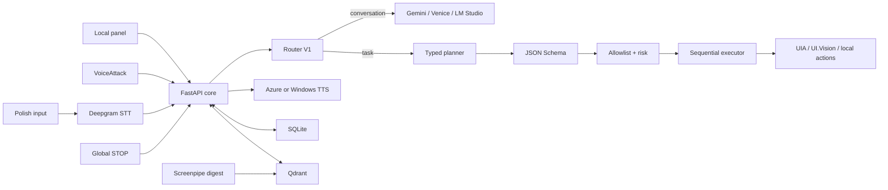

# VoiceLoop

Local-first voice and context assistant for Windows, built around Polish
speech. The language model may propose a plan. Local code decides whether
anything runs.

```text
LLM output is a proposal, not authority.
Local code decides what can run.
```

[](https://github.com/marcinromanowskilublin/VoiceLoop/actions/workflows/ci.yml)

This repository is the running system: typed contracts, an action allowlist,
a sequential executor, local memory, and a voice loop that can be stopped.
It is not a product pitch and not a general desktop agent. If you want to
understand it, look at the blocks below — each one is a real module with
tests.


*The local diagnostics panel. It is a development UI, not the final
interface. Optional providers are shown as they are, including when they
are offline.*

## How the blocks fit

A command is just a `CommandRequest` until local code accepts a
`CommandPlan`. Memory, screen text, and web results are context. They
cannot invent a new action.

```text
panel / Deepgram / VoiceAttack / API
    -> FastAPI core
    -> Router V1  (Routing V2 only in shadow)
    -> ProposedPlan from the model, or a deterministic plan
    -> CommandPlan after local binding
    -> allowlist + risk policy + confirmation
    -> one executor queue
    -> ActionResult, then speech or the panel
```



The same path always applies: one unknown `action_id` rejects the whole
plan. Model-declared risk cannot lower the risk on the local spec.
`response_text` must not claim that an action already succeeded. External
tool output is not fed back as executable intent.

## The blocks

These are the pieces worth opening. Older write-ups in `docs/` yield to
the code and to [`docs/ARCHITECTURE_CURRENT.md`](docs/ARCHITECTURE_CURRENT.md).

| Block | Where to look | What it actually does |
| --- | --- | --- |
| HTTP core | `listener/voiceloop/app.py` | Wires services, session token, SSE, listen-once modes. |
| Contracts | `listener/voiceloop/models.py` | `CommandRequest`, `CommandPlan`, `TranscriptEnvelopeV1`. |
| Router V1 | `listener/voiceloop/router.py` | Cheap deterministic plans and STT gates. No shell. |
| Router V2 | `listener/voiceloop/routing/` | Segment → capability match → assemble. Shadow only. |
| Planner | `listener/voiceloop/model_router.py` | `ProposedPlan` in, bound `CommandPlan` out. |
| Allowlist | `listener/voiceloop/actions.py` | 42 `ActionSpec` entries. Schema, risk, confirmation, handler. |
| Desktop UIA | `listener/voiceloop/windows_shell.py` | Visible desktop and Explorer items. Not `cmd`. |
| Path journal | `listener/voiceloop/windows_context.py` | Local folder/file history with explicit roots. |
| Executor | `listener/voiceloop/executor.py` | One plan at a time. Queue limit, confirmation TTL, STOP. |
| Voice loop | `listener/voiceloop/voice_conversation.py` | Half-duplex, barge-in, pause, speaker gate. Polish stays Polish. |
| Memory | `listener/voiceloop/memory.py` | SQLite operational state and explicit notes. |
| Vectors | `listener/voiceloop/qdrant_memory.py` | Five named spaces, separate capabilities collection. |
| Thresholds | `listener/voiceloop/threshold_guard.py` | Measures retrieval thresholds. Does not write vectors. |
| Situation | `listener/voiceloop/situation/` | Read-only ledger. `GET /api/v1/situation`. Not a source of actions. |
| Commitments | `listener/voiceloop/commitments/` | Text analysis only. Not wired into routing. |
| Eval | `listener/voiceloop/corpus/` | Voice and routing evaluation. Private audio stays local. |
| Panel | `panel/` | Local browser UI. |
| Vectorscope | `vectorscope/` | Embedding geometry, read-only against Qdrant. |
| VoiceAttack | `voiceattack/`, `scripts/va/` | Constrained wake phrases into the same API. |
| Tests | `tests/` | Unit and regression suite. CI on `windows-latest`. |

Memory is a hybrid, not a single search trick:

- **A** — Qdrant hits concatenated with SQL memories into the planner context.
- **B** — SQLite cosine fallback on the `semantic` axis when Qdrant is empty or down.
- **C** — `remember` / `recall` write SQL first; Qdrant is an index; last resort is a substring.

Capabilities live in `voiceloop_capabilities_v1`. They are not merged into
`voiceloop_memory`. Embeddings are local Nomic 768d through LM Studio when
that path is enabled.

## Three shelves

Keep these separate. Mixing them is how the system becomes unclear.

**Runs today.** Input → V1 router → optional model plan → policy →
executor. Windows actions, STOP, SQLite, optional Qdrant and Screenpipe,
VoiceAttack, Azure or Windows TTS.

**Present, not in charge.** Routing V2 (shadow), commitment detector,
`SituationStateV1`, `StateProposal`, Hume, n8n. Code and tests exist.
They do not steer the planner or the executor.

**Not next.** Live V2 only after a quality gate with numbers. Situation
state must not become a source of `action_id`. The model must not write
situation facts. There is no shell tool for the LLM.

## Safety, in practice

- loopback-first services; private routes need `X-VoiceLoop-Token`;
- secrets stay in `listener/.env`, which is not in Git;
- 0 high-risk actions on the allowlist; several medium actions need
  confirmation;
- one execution path; STOP cancels the queue, the current action, the
  model call, and TTS;
- Screenpipe defaults to a reduced capture mode.

VoiceLoop is controlled local assistance. It is not a sandbox-escape
framework.

## Quick start

Windows, Python 3.11. Copy `listener/.env.example` to `listener/.env`
and enable only the providers you want.

```powershell
copy .\listener\.env.example .\listener\.env
.\scripts\start-core.bat
```

Panel: `http://127.0.0.1:8765`.

Full local stack (LM Studio, Qdrant 1.19, Screenpipe, listener,
VoiceAttack when installed):

```powershell
powershell -ExecutionPolicy Bypass -File .\scripts\start-all.ps1
```

Full Screenpipe capture is opt-in: `.\scripts\start-all.ps1 -FullScreenpipeCapture`.

Private endpoints need `X-VoiceLoop-Token`. The panel reads it from the
loopback `GET /api/v1/session`. OpenAPI: `http://127.0.0.1:8765/api/docs`.

```text
GET  /api/v1/health
GET  /api/v1/capabilities
GET  /api/v1/situation
POST /api/v1/commands
POST /api/v1/commands/{id}/confirm
POST /api/v1/stop
POST /api/v1/conversation/start
POST /api/v1/listening/start
GET  /api/v1/memories
```

## Tests

From `listener/`, same path as CI:

```powershell
cd listener
.\.venv\Scripts\python.exe -m pip install -r requirements-dev.txt
.\.venv\Scripts\python.exe -m ruff check `
  voiceloop `
  ..\tests `
  ..\scripts\voice_capture_server.py `
  ..\scripts\holding-commands\server.py `
  ..\scripts\calibration-phrases\server.py
.\.venv\Scripts\python.exe -m pytest -c pyproject.toml -q
```

Pytest isolates `Settings` from `listener/.env`.

## What is not in Git

- `listener/.env`, tokens, SQLite, Qdrant volumes, logs;
- meeting recordings, transcripts, private voice samples;
- Screenpipe captures and local screenshots;
- medical or patient data;
- private notes under `sources/` (local drop folder only).

## Limits

- Full stack is Windows-specific.
- Optional providers need keys and may cost money.
- Deepgram diarization is not voice biometrics.
- Screenpipe can see a lot of local activity if you turn capture up.
- Hume, n8n, commitments, and situation state are not production
  features.
- No public open-source license.

## Docs

- [`docs/ARCHITECTURE_CURRENT.md`](docs/ARCHITECTURE_CURRENT.md) — current baseline.
- [`docs/ARCHITECTURE_INVARIANTS.md`](docs/ARCHITECTURE_INVARIANTS.md) — frozen rules.
- [`docs/COMMITMENT_LAYER.md`](docs/COMMITMENT_LAYER.md) — commitment analysis.
- [`docs/PORTFOLIO_PL.md`](docs/PORTFOLIO_PL.md) — Polish portfolio notes.
- [`vectorscope/README.md`](vectorscope/README.md) — embedding diagnostics.
- [`voiceattack/INSTRUKCJA.md`](voiceattack/INSTRUKCJA.md) — VoiceAttack profile.

## License

Published for review as a portfolio repository. No permission is granted
to copy, modify, or redistribute the code. Local data is not included.
