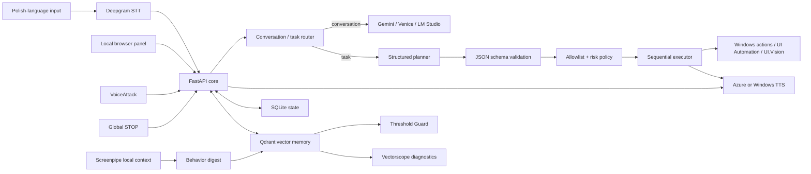

# VoiceLoop

**VoiceLoop is a local-first assistant for Windows automation, Polish-language
voice interaction, private context memory, and measurable voice-agent quality.**

It is not a generic "LLM with tools" demo. The project is built around a stricter
idea: a language model may interpret intent, but it must not become a shell, a
macro generator, or an unrestricted operating-system agent. Every executable
step has to pass through typed local contracts, an allowlist, risk policy, and a
sequential executor.

[](https://github.com/marcinromanowskilublin/VoiceLoop/actions/workflows/ci.yml)

## What The Program Is

VoiceLoop is a Python 3.11 application designed for local Windows workflows. It
combines a FastAPI control core, a local browser panel, speech-to-text
integration, local and cloud-compatible LLM planners, optional Qdrant vector
memory, Screenpipe context ingestion, VoiceAttack command support, and a
testable evaluation pipeline.

In practice, it lets the user:

- speak commands and questions naturally in Polish;
- hold a short voice conversation with interruption and STOP control;
- execute only known, allowlisted Windows actions;
- inspect health, routing, memory, and component readiness from a local panel;
- collect and evaluate private voice samples without publishing the private data;
- build a local context layer from Screenpipe and Qdrant;
- measure whether memory thresholds and vector behavior actually work.

## Why It Exists

Most assistant prototypes optimize for a fluent demo. VoiceLoop focuses on the
harder engineering questions:

- How do you let an LLM help with desktop actions without giving it arbitrary
  control of the computer?
- How do you keep Polish-language voice interaction usable when speech
  recognition is imperfect?
- How do you stop the system immediately when the user interrupts?
- How do you preserve privacy while still building useful context memory?
- How do you measure whether vector thresholds, deduplication, routing, and
  voice evaluation are behaving honestly?

The result is a research-oriented but runnable local assistant. It is useful as a
portfolio project because it shows architecture, safety boundaries, local AI
integration, evaluation discipline, and Windows automation in one system.

## Current Portfolio Status

The repository contains code and documentation for a functioning local system.
Private runtime data is intentionally excluded.

Verified or implemented areas include:

- FastAPI core and local web panel;
- Deepgram STT configured for Polish;
- conversation/task separation;
- typed action planning with allowlisted `action_id` values;
- fail-closed Gemini task planning for unknown actions and invalid dependencies;
- local execution policy and confirmation gates;
- SQLite operational state;
- optional Qdrant named-vector memory;
- Screenpipe-to-memory ingestion with local behavior digest;
- Threshold Guard for live vector-threshold diagnostics;
- Vectorscope diagnostics for embeddings, prefixes, geometry, and live Qdrant data;
- one-click Windows launcher for the local stack;
- VoiceAttack profile audit tooling;
- private voice-evaluation pipeline and local sample-capture panels;
- pytest and Ruff coverage for critical safety and memory behavior.

Hume and n8n remain optional or experimental. They are present in the codebase
but should not be presented as required production features.

## How It Works

At a high level:

```text
voice / panel / VoiceAttack
    -> FastAPI core
    -> deterministic command or model planner
    -> validated CommandPlan
    -> local action allowlist
    -> risk and confirmation policy
    -> sequential executor
    -> spoken or panel-visible result
```

The most important boundary is this:

```text
LLM output is a proposal, not authority.
Local code decides what can run.
```

The model can produce a structured plan, but it cannot invent an executable
tool, run shell commands, bypass risk, lower confirmation requirements, or
execute partially valid plans.

## Architecture



## Core Modules

### 1. Capture

VoiceLoop can receive input from:

- Deepgram live or one-shot transcription;
- the local browser panel;
- VoiceAttack commands;
- local API calls;
- Screenpipe activity streams for context memory.

The system is designed for Polish dictation and command phrasing. It keeps the
Polish text as Polish instead of translating commands into English.

### 2. Planning

Known commands can be routed deterministically. More open-ended requests can use
a model planner.

The task planner returns a typed structure:

```text
intent
response_text
requires_clarification
clarification_question
steps[action_id, args, depends_on, risk, confirmation_required]
```

Recent hardening makes task plans fail closed:

- if one proposed step has an unknown `action_id`, the whole plan is rejected;
- `depends_on` may reference only earlier step indexes;
- self-dependencies, future dependencies, duplicate dependencies, and invalid
  graphs are rejected before execution;
- external tool output is not fed to the task planner as executable intent;
- `response_text` must not claim that an action already succeeded.

### 3. Execution

The executor runs only local `ActionSpec` definitions. Each action has:

- an identifier;
- a JSON-like argument schema;
- a risk level;
- a confirmation requirement;
- a handler implemented in local code;
- optional routing examples and execution-layer metadata.

This keeps execution deterministic even when planning used a probabilistic model.

### 4. Memory

VoiceLoop uses several memory layers:

- SQLite for operational state, explicit memories, commands, and traces;
- Qdrant for optional vector memory;
- named vector spaces for semantic, topic, intent, decision, and person-context
  views;
- Screenpipe ingestion for local activity summaries;
- content-hash and semantic deduplication;
- Threshold Guard to detect dead, unreachable, over-broad, or drifted thresholds.

The memory system is intentionally local-first. Private data, local recordings,
Qdrant storage, logs, and `.env` secrets are not committed.

### 5. Evaluation

VoiceLoop includes a private voice-evaluation pipeline:

```text
local audio inventory
    -> source and speaker gates
    -> candidate generation
    -> hashes and deduplication
    -> frozen development / holdout split
    -> manual annotation
    -> STT, routing, and prosody metrics
```

The repository contains the pipeline and invariants, not the private dataset.

### 6. Diagnostics

Diagnostics are a first-class part of the system:

- `/api/v1/health` reports component readiness and threshold warnings;
- Vectorscope visualizes embeddings, projection geometry, prefixes, and live
  Qdrant retrieval distributions;
- Qdrant migration scripts can re-embed schema versions and remove duplicates;
- VoiceAttack audit tooling compares the profile, wrappers, and live capability
  catalog without executing actions.

## What VoiceLoop Can Do

Examples of supported or designed capabilities:

- start, pause, resume, and stop voice listening;
- hold a short conversation in Polish;
- open selected local apps and URLs;
- describe the active window;
- summarize recent local activity from Screenpipe context;
- create explicit memories;
- query local vector memory;
- inspect available actions;
- copy or select UI text through approved automation paths;
- run constrained VoiceAttack and UI.Vision actions;
- launch the local stack with one script.

The system is deliberately conservative. If a capability is missing or risky,
the planner should ask a clarification question or require confirmation rather
than pretending to have completed the task.

## Safety Model

VoiceLoop is designed around defense in depth:

- loopback-first services;
- token-protected private endpoints;
- `.env` secrets excluded from Git;
- LLM output parsed through strict schemas;
- unknown actions rejected;
- invalid multi-step plans rejected;
- arguments validated against local schemas;
- model risk cannot reduce local action risk;
- high-risk actions require confirmation;
- one active execution path at a time;
- STOP cancels queued work, active action, model work, and TTS;
- external OCR, memory, and web text are treated as untrusted data.

The project is not a sandbox escape framework and not a general autonomous
desktop agent. Its purpose is controlled local assistance.

## Local Stack

The easiest entry point is:

```text
Start-VoiceLoop.bat
```

Equivalent PowerShell:

```powershell
powershell -ExecutionPolicy Bypass -File .\scripts\start-all.ps1
```

The launcher coordinates:

- LM Studio readiness;
- Qdrant on `127.0.0.1:6333`;
- Screenpipe in safe context-only mode by default;
- the VoiceLoop FastAPI listener;
- VoiceAttack when available;
- a static audit of VoiceAttack actions;
- optional smoke testing.

By default, Screenpipe starts in a reduced privacy mode for context:

- OCR/accessibility context enabled;
- audio disabled;
- keyboard capture disabled;
- clipboard capture disabled;
- click capture disabled;
- telemetry disabled;
- PII removal enabled.

Full Screenpipe capture requires an explicit flag:

```powershell
.\scripts\start-all.ps1 -FullScreenpipeCapture
```

## Quick Start

### Requirements

VoiceLoop targets Windows.

Minimum:

- Python 3.11;
- a local `listener/.env` copied from `listener/.env.example`;
- the provider keys or local models you explicitly enable.

Optional full stack:

- LM Studio;
- Docker Desktop for Qdrant;
- Screenpipe;
- VoiceAttack;
- UI.Vision;
- Azure Speech;
- Deepgram;
- Gemini or another OpenAI-compatible planner.

### Configure

```powershell
copy .\listener\.env.example .\listener\.env
```

Keep all secrets in `listener/.env`. Never commit or display that file.

### Run The Core Only

```powershell
.\scripts\start-core.bat
```

Open:

```text
http://127.0.0.1:8765
```

### Run The Full Local Stack

```powershell
Start-VoiceLoop.bat
```

or:

```powershell
powershell -ExecutionPolicy Bypass -File .\scripts\start-all.ps1
```

## API

Important local endpoints:

```text
GET  /api/v1/session
GET  /api/v1/health
GET  /api/v1/events
GET  /api/v1/capabilities
POST /api/v1/commands
GET  /api/v1/commands
POST /api/v1/commands/{id}/confirm
POST /api/v1/commands/{id}/cancel
POST /api/v1/stop
POST /api/v1/conversation/start
POST /api/v1/conversation/interrupt
POST /api/v1/conversation/resume
POST /api/v1/conversation/stop
POST /api/v1/listening/start
POST /api/v1/listening/stop
GET  /api/v1/memories
POST /api/v1/memories
```

Private endpoints require `X-VoiceLoop-Token`. The panel obtains the token from
the loopback-only session endpoint.

OpenAPI is available locally:

```text
http://127.0.0.1:8765/api/docs
```

## Testing

From the repository root:

```powershell
.\listener\.venv\Scripts\python.exe -m pytest -q
```

Targeted safety and memory regression tests used during the latest portfolio
commit:

```powershell
.\listener\.venv\Scripts\python.exe -m pytest `
  tests/test_threshold_guard.py `
  tests/test_qdrant_memory.py `
  tests/test_screenpipe.py `
  tests/test_assets.py `
  tests/test_model_router.py `
  -q
```

Lint selected staged areas:

```powershell
.\listener\.venv\Scripts\python.exe -m ruff check `
  listener/voiceloop `
  tests `
  scripts/check_voiceattack_actions.py `
  scripts/dedupe-collection.py `
  scripts/reembed-memory-schema-c2.py `
  vectorscope
```

Note: local `.env` values can affect provider-specific tests. CI should run with
clean test configuration and without private runtime secrets.

## Privacy Boundaries

Never commit:

- `listener/.env`;
- `data/`;
- Qdrant storage;
- runtime logs;
- local tokens;
- meeting recordings;
- transcripts;
- screenshots;
- private voice samples;
- medical or patient data.

This repository contains implementation code, tests, schemas, and documentation.
It does not contain the private memory or private evaluation corpus.

## Repository Map

```text
VoiceLoop/
├── listener/voiceloop/       FastAPI core, routing, memory, voice loop
├── panel/                    local browser interface
├── vectorscope/              embedding and Qdrant diagnostics
├── tests/                    unit and regression tests
├── docs/                     architecture, handoff, and planning docs
├── scripts/                  startup, migration, audit, and capture tools
├── voiceattack/              constrained voice-command profile docs
├── uivision/macros/          approved UI automation macros
├── n8n/                      optional deterministic workflow
├── data/                     local runtime data, ignored
└── logs/                     local runtime logs, ignored
```

## Key Files

- `listener/voiceloop/app.py` — FastAPI application and service wiring.
- `listener/voiceloop/model_router.py` — conversation/task planner contracts.
- `listener/voiceloop/actions.py` — local action registry and policy.
- `listener/voiceloop/qdrant_memory.py` — vector memory backend.
- `listener/voiceloop/screenpipe_memory.py` — Screenpipe digest-to-memory worker.
- `listener/voiceloop/threshold_guard.py` — live threshold diagnostics.
- `vectorscope/live.py` — read-only live Qdrant measurement.
- `scripts/start-all.ps1` — full local stack launcher.
- `scripts/check_voiceattack_actions.py` — non-executing VoiceAttack audit.

## Known Limitations

- Full reproduction is Windows-specific.
- Optional providers require credentials and may incur cost.
- Deepgram diarization is not voice biometrics.
- Screenpipe must be configured carefully because it can observe broad local
  activity.
- Hume and n8n are optional and not required for the core portfolio demo.
- The repository is published without a public open-source license.

## Documentation

- [`docs/PORTFOLIO_PL.md`](docs/PORTFOLIO_PL.md) — portfolio scope in Polish.
- [`docs/VOICELOOP_ARCHITECTURE_HANDOFF.md`](docs/VOICELOOP_ARCHITECTURE_HANDOFF.md) — detailed Polish architecture handoff.
- [`docs/PLAN_2026-08-26.md`](docs/PLAN_2026-08-26.md) — implementation plan and operational notes.
- [`vectorscope/README.md`](vectorscope/README.md) — embedding diagnostics.
- [`voiceattack/INSTRUKCJA.md`](voiceattack/INSTRUKCJA.md) — VoiceAttack setup and command inventory.

## License And Portfolio Use

VoiceLoop is published as a portfolio repository without an open-source license.
The code and documentation are available for review, but no permission to copy,
modify, or redistribute them is granted. Local data is not included.
