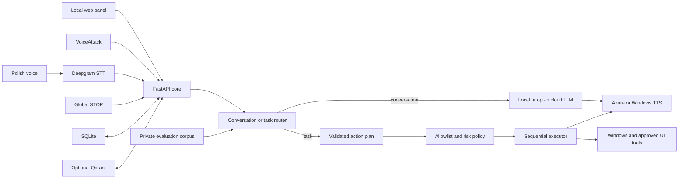

# VoiceLoop

**What it is.** VoiceLoop is a local-control-first Polish voice assistant for
Windows, built around a FastAPI core and a strict boundary between language
models and operating-system actions.

**What it does.** It turns speech into either a natural conversation or a
validated, typed action plan; executes only allowlisted actions; speaks the
result; and lets the user interrupt the entire loop at any time.

**Why it exists.** Most assistant demos optimize for fluency and hide the hard
parts: unsafe tool execution, accidental triggers, cloud privacy, unreliable
audio, and results that cannot be measured. VoiceLoop is an engineering project
about making that loop controllable, inspectable, and testable.

[](https://github.com/marcinromanowskilublin/VoiceLoop/actions/workflows/ci.yml)

> **Portfolio status:** the core, safety model, voice-evaluation pipeline, API,
> and local tooling are verified. Hume and n8n are explicitly optional or
> experimental and are not presented as production features.

## At a glance

- **Focus:** applied AI, safe tool use, Polish voice UX, and measurable quality.
- **Proof:** 541 tests pass; one private-data replay is intentionally skipped;
  full Ruff and Windows CI pass.
- **Platform:** Windows and Python 3.11, with a local FastAPI control plane.
- **Cloud boundary:** Deepgram and optional model/TTS providers may use cloud
  APIs; execution policy, state, secrets, and private datasets stay local.

## Why this project matters

A voice assistant that can operate a computer has two very different jobs:

1. understand open-ended human language;
2. perform a small, controlled set of deterministic actions.

VoiceLoop keeps those jobs separate. The model may interpret intent, but it
cannot send arbitrary shell commands or lower an action's risk level. Every
executable step must match a local `action_id`, pass argument validation, and
go through the execution policy.

This makes the project useful as a case study in:

- applied and agentic AI engineering;
- Polish conversational and voice interfaces;
- safe model-to-tool boundaries;
- local-first memory and privacy;
- evaluation with frozen data and regression tests;
- turning a prototype into a reproducible system.

## Core capabilities

### Polish voice interaction

- Deepgram Nova-3 for Polish speech-to-text.
- Managed conversation sessions with short-term context.
- Barge-in that can stop model generation and speech playback.
- Echo filtering around synthesized speech.
- Multi-speaker guards based on diarization metadata.
- Deterministic pause, resume, and global STOP commands.
- Azure Speech SDK, Azure REST, and Windows TTS fallbacks.

### Safe Windows actions

- Static allowlist of executable `action_id` values.
- Validated arguments instead of model-generated code.
- Explicit risk levels controlled by local code.
- Confirmation for high-risk operations.
- Sequential execution and request deduplication.
- Direct STOP path that bypasses the model and optional routers.
- VoiceAttack and UI.Vision adapters for constrained Windows automation.

### Local memory and context

- SQLite for durable operational state and explicit memories.
- Optional Qdrant collections with named vector spaces.
- Optional Screenpipe ingestion through a local digest and privacy gate.
- Bounded retrieval context instead of sending the complete local history.
- Local Qwen and Nomic models through LM Studio.

### Evaluation instead of demo-only claims

- Frozen voice-evaluation split: 30 development and 90 holdout samples.
- Audio provenance, hashes, deduplication, speaker confirmation, and manual
  annotations.
- Atomic metadata publication when adding meeting-microphone samples.
- Windows CI on Python 3.11 with full Ruff and pytest runs.

This repository verifies the evaluation infrastructure and its invariants. It
does not publish WER, routing-accuracy, or prosody scores from the private local
corpus, so this README makes no model-quality claim based on those results.

## Architecture



The most important boundary is:

```text
natural language
    -> model interpretation
    -> validated JSON schema
    -> local action_id allowlist
    -> local risk policy
    -> sequential executor
```

The model never becomes a shell.

## Conversation and task contracts

VoiceLoop uses two separate model contracts:

- **Conversation:** the model returns a short natural-language response, which
  may be sent to TTS.
- **Task:** the planner returns structured JSON containing allowlisted
  `action_id` values and validated arguments.

Malformed or truncated task JSON is a protocol failure. It is not silently
converted into a conversational answer.

Known deterministic commands can bypass model planning entirely. Natural
requests may use the planner, but execution always returns to the same local
policy.

## Safety model

VoiceLoop is not a general-purpose shell agent.

- Services bind to loopback.
- Detailed health and the SSE event stream require a local token.
- The browser panel sends the token in `X-VoiceLoop-Token`.
- Gemini and Hume credentials are sent in headers, not query strings.
- LLM output cannot reduce locally assigned risk.
- High-risk steps require explicit confirmation.
- Only one screen action executes at a time.
- `request_id` and deduplication windows reduce repeated execution.
- STOP cancels model work, TTS, queued work, and the active action.
- `.env`, runtime data, recordings, logs, and tokens are excluded from Git.

## Voice evaluation pipeline

The private voice corpus is designed to preserve evaluation integrity:

```text
local audio inventory
    -> source and speaker gates
    -> candidate segmentation
    -> quality tags and deduplication
    -> frozen development and holdout split
    -> manual annotation
    -> STT, routing, and prosody metrics
```

Meeting samples can be prepared with:

```powershell
cd listener
.\.venv\Scripts\python -m voiceloop.corpus prepare-meeting-voice `
  --confirm SELF_AUDIO_ONLY
```

The command:

- accepts only `input-microphone-*.wav`;
- excludes output-channel audio;
- stages generated candidates in a temporary directory;
- verifies the frozen holdout before metadata changes;
- creates a backup of existing evaluation artifacts;
- publishes the candidates only after validation.

The private corpus and all recordings remain under ignored `data/` paths.

## Local voice-sample tools

Two loopback-only panels help collect self-recorded samples:

```powershell
python .\scripts\holding-commands\server.py
python .\scripts\calibration-phrases\server.py
```

- `http://127.0.0.1:8791` — stable command set;
- `http://127.0.0.1:8792` — varied Polish calibration phrases.

They write only to local `data/` directories and do not upload audio. See
[`scripts/VOICE_CAPTURE_TOOLS.md`](scripts/VOICE_CAPTURE_TOOLS.md).

## Technology

The verified implementation uses:

- Python 3.11;
- FastAPI and Uvicorn;
- Pydantic models and settings;
- Deepgram streaming and file transcription;
- Gemini, Venice, or LM Studio-compatible model APIs;
- Azure Speech and Windows TTS;
- SQLite and optional Qdrant;
- Screenpipe as an optional local context source;
- VoiceAttack, UI Automation, and UI.Vision;
- pytest, Ruff, and GitHub Actions.

## Quick start

### Requirements

The project targets Windows. A minimal core demo needs:

- Python 3.11;
- a local `listener/.env` created from `.env.example`;
- only the providers you explicitly choose to enable.

A full local stack may additionally use:

- LM Studio;
- Docker Desktop for Qdrant;
- Screenpipe;
- VoiceAttack and UI.Vision.

Hume and n8n are not required.

### Configure

```powershell
copy .\listener\.env.example .\listener\.env
```

Keep secrets only in `listener/.env`. Do not commit or display that file.

The default configuration is local-first:

```text
LLM_PRIMARY=local
N8N_ENABLED=false
HUME_EMOTION_ANALYSIS_ENABLED=false
AUTO_START_LISTENING=false
AUTO_START_CONVERSATION=false
```

### Start the core

```powershell
.\scripts\start-core.bat
```

Open:

```text
http://127.0.0.1:8765
```

The core is designed to start in a degraded mode when optional services are
offline. Health reports which components are ready, stopped, or unavailable.

### Start the optional local stack

```powershell
powershell -ExecutionPolicy Bypass -File .\scripts\start-all.ps1
```

This starts Qdrant, Screenpipe, and the VoiceLoop core. It does not
automatically enable n8n or Hume.

## Test and verify

From `listener/`:

```powershell
.\.venv\Scripts\python -m ruff check `
  voiceloop ..\tests `
  ..\scripts\voice_capture_server.py `
  ..\scripts\holding-commands\server.py `
  ..\scripts\calibration-phrases\server.py

.\.venv\Scripts\python -m pytest -c pyproject.toml -q
```

Safe API smoke test:

```powershell
powershell -ExecutionPolicy Bypass -File .\scripts\test-loop.ps1
```

The smoke test does not start the microphone or execute screen actions.

## Local API

Important endpoints include:

```text
GET  /api/v1/session
GET  /api/v1/health
GET  /api/v1/events
POST /api/v1/commands
GET  /api/v1/commands
POST /api/v1/commands/{id}/confirm
POST /api/v1/commands/{id}/cancel
POST /api/v1/stop
POST /api/v1/conversation/start
POST /api/v1/conversation/interrupt
POST /api/v1/conversation/resume
POST /api/v1/conversation/stop
POST /api/v1/listening/start
POST /api/v1/listening/stop
GET  /api/v1/memories
POST /api/v1/memories
```

Private endpoints require `X-VoiceLoop-Token`. The panel obtains the local token
through the loopback-only session endpoint.

OpenAPI is available locally at:

```text
http://127.0.0.1:8765/api/docs
```

## Optional and experimental components

### Hume

The repository contains an experimental prosody client and parser tests.
`HUME_EMOTION_ANALYSIS_ENABLED=false` is the default.

It has not been verified as an end-to-end portfolio demo and must not be
presented as a production feature. Enabling it would send meeting-audio chunks
to Hume's cloud API.

### n8n

The repository contains a small deterministic n8n workflow, but
`N8N_ENABLED=false` is the default. It is not required by the core portfolio
demo.

### Screenpipe

Screenpipe is an optional source of broad local computer context. A full
Screenpipe setup may capture screens, audio, clipboard, and input activity.
It is intentionally excluded from the controlled portfolio demo.

## Privacy boundaries

Never commit or publish:

- `listener/.env`;
- `data/`;
- runtime logs;
- local tokens;
- meeting recordings or transcripts;
- private screenshots;
- medical or patient data;
- private corpus samples.

The repository contains code and schemas for private data processing, not the
private data itself.

## Repository map

```text
VoiceLoop/
├── listener/voiceloop/       FastAPI core, routing, memory, voice loop
├── panel/                    local web interface
├── tests/                    unit and integration tests
├── docs/                     architecture and portfolio documentation
├── scripts/                  startup, smoke, automation, capture tools
├── voiceattack/              constrained voice-command profiles
├── uivision/macros/          approved UI automation macros
├── n8n/                      optional deterministic workflow
├── data/                     local runtime data, ignored
└── logs/                     local runtime logs, ignored
```

## Known limitations

- Full reproduction is Windows-specific and requires several optional tools.
- Cloud STT, LLM, and TTS providers require credentials and may incur cost.
- Diarization distinguishes speakers in a stream; it is not voice biometrics.
- Screenpipe requires careful privacy configuration.
- The n8n webhook still relies on loopback rather than application-level
  authentication.
- Hume remains an unverified experiment.
- The repository does not currently have a public open-source license.

## Documentation

- [`docs/PORTFOLIO_PL.md`](docs/PORTFOLIO_PL.md) — honest portfolio scope in Polish.
- [`docs/VOICELOOP_ARCHITECTURE_HANDOFF.md`](docs/VOICELOOP_ARCHITECTURE_HANDOFF.md) — detailed architecture and operational handoff in Polish.
- [`docs/VOICELOOP_ARCHITECTURE_HANDOFF.pdf`](docs/VOICELOOP_ARCHITECTURE_HANDOFF.pdf) — generated handoff PDF.
- [`docs/SAFE_USER_CORPUS.md`](docs/SAFE_USER_CORPUS.md) — private corpus and evaluation design in Polish.
- [`scripts/VOICE_CAPTURE_TOOLS.md`](scripts/VOICE_CAPTURE_TOOLS.md) — local sample-capture tools.

## License and portfolio use

VoiceLoop is published as a portfolio repository without an open-source
license. The code and documentation are available for review, but no permission
to copy, modify, or redistribute them is granted. Local data is not included.
