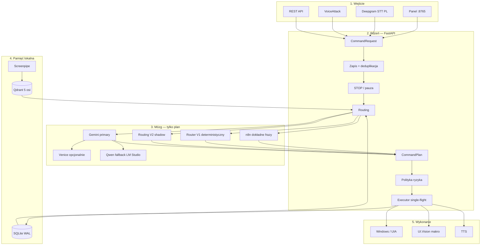
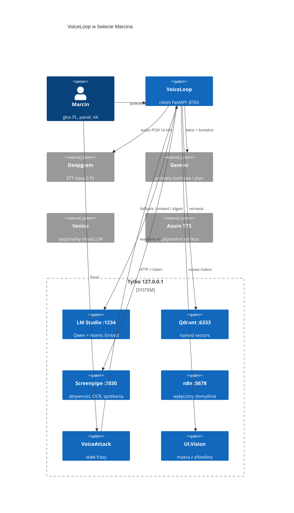
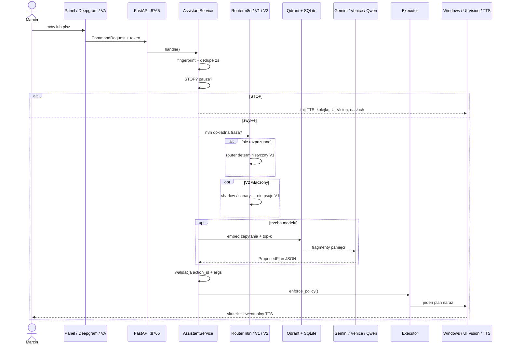
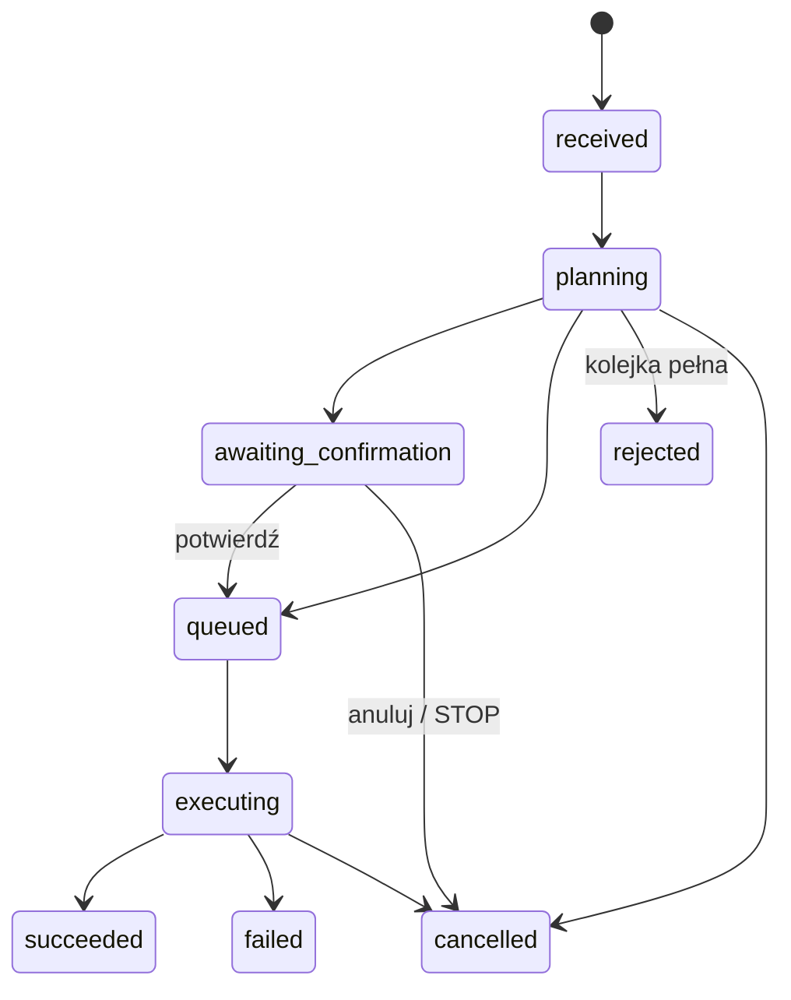
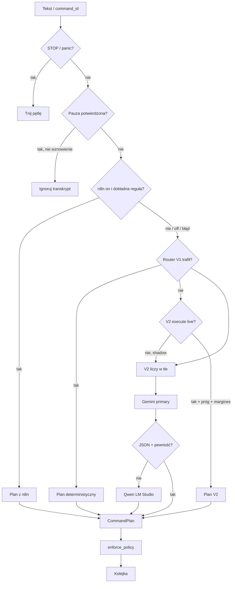
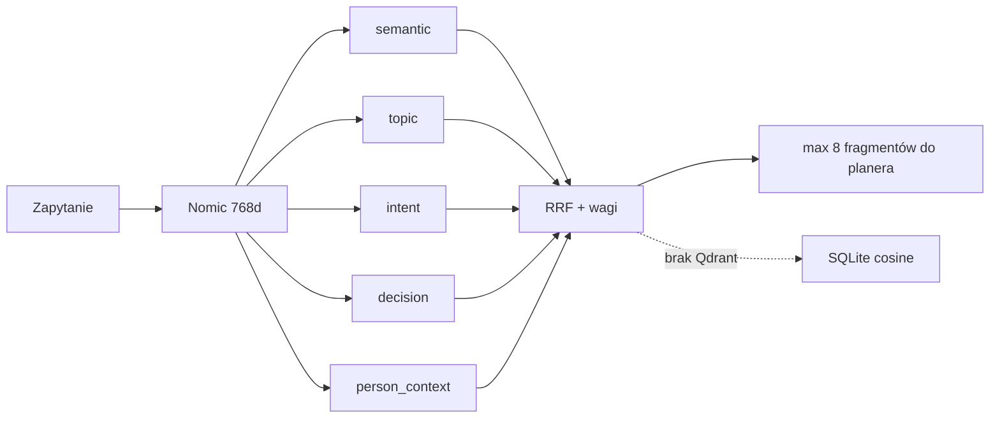
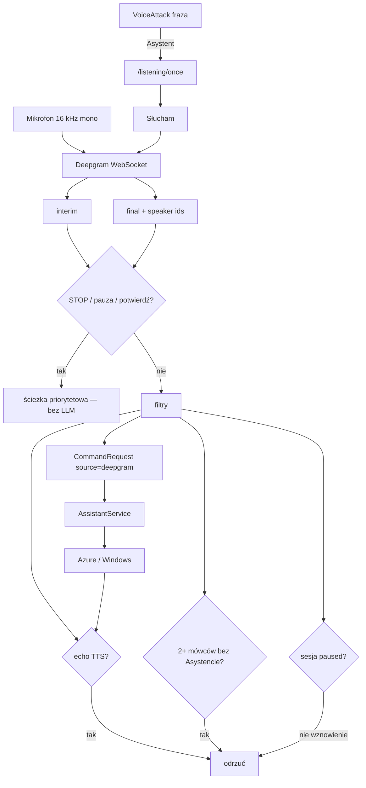

# VoiceLoop — architektura do wizualizacji w Notion

Wersja opisu: **30 sierpnia 2026**  
Wersja projektu: **0.2.0**  
Źródło prawdy: kod w `listener/voiceloop/` (nie slajd, nie wizja)

**To jest jeden plik — cały materiał.** Import Markdown albo Ctrl+A / Ctrl+V. Albo wklej **tylko blok poniżej** w Ask AI / Generate dataset.

---

## PROMPT — wklej w całości do Ask AI

```
Zrób stronę „VoiceLoop — architektura” po polsku. Nie pytaj, nie stopuj, idź po kolei od 1 do 8. Nie wymyślaj liczb ani akcji spoza danych z tego promptu. Gdy dwa opisy się kłócą, wygrywa kod, nie wykres.

KROK 1 — tytuł i teza
Tytuł: VoiceLoop — architektura.
Podtytuł: LLM planuje. Lokalny kod decyduje, czy wolno. Executor robi jedną rzecz naraz. STOP tnie wszystko.
Jedno zdanie: lokalny asystent Windows po polsku; FastAPI na 127.0.0.1:8765; model nie dostaje powłoki — zwraca tylko typowany plan action_id + argumenty.

KROK 2 — wykres „Źródła prawdy”
Typ: treemap albo stacked bar.
Tytuł: Źródła prawdy.
Podtytuł: SHGetFileInfo / shell32.dll przy folderach to nie błąd — Windows kłamie, ikona jest w desktop.ini.
Dane (wklej 1:1):
obszar	źródło_wygrywa	nie_jest_prawdą	waga
Wejście i API	kod: app.py + models.py	stary panel deepgram.html	5
Routing	kod: router.py + assistant.py	handoff z 11.08	5
Allowlista akcji	kod: actions.py	tabela w PDF	5
Ryzyko i zgoda	kod: enforce_policy()	to co LLM napisze w planie	5
Pamięć wektorów	Qdrant voiceloop_memory	same wspomnienia SQLite	4
Stan komend	SQLite commands	panel SSE jako archiwum	4
Konfiguracja	listener/.env + settings.py	README	4
Głos STT	Deepgram + voice_conversation.py	wildcard VoiceAttack	3
Fraza stała	VoiceLoop-v2.vap	ręczna lista w czacie	3
Ikony pulpitu	desktop.ini + C:\Icons	SHGetFileInfo / shell32.dll	2
Dokumentacja	ten plik	sam wykres	1
Pola: obszar = kategoria, waga = wielkość, źródło_wygrywa = etykieta.

KROK 3 — wykres „Warstwy”
Typ: bar. Tytuł: Warstwy. X = warstwa, Y = elementy.
warstwa	elementy	co_to
Wejście	4	panel, Deepgram, VoiceAttack, API
Rdzeń	6	request, dedupe, STOP, routing, plan, executor
Mózg	6	n8n, V1, V2 shadow, Gemini, Venice, Qwen
Pamięć	3	SQLite, Qdrant 5 osi, Screenpipe
Wykonanie	3	Windows/UIA, UI.Vision, TTS

KROK 4 — wykres „Porty”
Typ: bar. Tytuł: Porty loopback. Y = port.
usługa	port	stan
LM Studio	1234	lokalny
Screenpipe	3030	lokalny
n8n	5678	domyślnie off
Qdrant	6333	lokalny
VoiceLoop	8765	rdzeń

KROK 5 — wykres „Ryzyko akcji”
Typ: donut. Tytuł: Allowlista — ryzyko.
ryzyko	akcje	zgoda_wymagana
low	26	0
medium	7	6
high	0	0

KROK 6 — wykres „Wagi Qdrant”
Typ: bar. Tytuł: Pamięć — pięć osi. Y = waga 0–1.
os	waga	sens
semantic	0.40	o czym
topic	0.20	temat
intent	0.15	po co
decision	0.15	decyzje
person_context	0.10	osoby

KROK 7 — jeśli zostało miejsce na szósty obiekt, nie rób szóstego wykresu (limit 5). Zamiast tego napisz listę kolejności routingu:
1 STOP/pauza
2 n8n dokładna fraza
3 Router V1
4 V2 shadow (liczy, nie steruje)
5 Gemini primary
6 Qwen fallback
7 polityka + executor

KROK 8 — na dole strony wklej zdanie:
Wejście → zapis → STOP → tanie reguły → shadow V2 → retrieval → LLM składa plan → lokalna polityka → jeden executor → Windows. Model nie jest systemem operacyjnym. Jest doradcą z formularzem.

Koniec. Nie dodawaj innych wykresów. Nie zmieniaj liczb.
```

---

---

## 0. Jedno zdanie

VoiceLoop to **lokalny asystent Windows po polsku**: głos i tekst wchodzą do FastAPI na loopback, model **nie dostaje powłoki** — zwraca tylko typowany plan (`action_id` + argumenty), a lokalny kod waliduje, pyta o zgodę i wykonuje.

Teza bezpieczeństwa:

> LLM planuje. Lokalny kod decyduje, czy wolno. Executor robi jedną rzecz naraz. STOP tnie wszystko.

---

## 1. Po co ten system istnieje

Ma rozumieć polskie polecenia, pamiętać fakty, znać lokalny kontekst aktywności, planować kilka kroków i ruszać Windows — **bez dowolnego shell z odpowiedzi modelu**.

Nie jest ogólnym agentem typu „wykonaj cokolwiek”. Granica jest twarda: allowlista akcji + schemat argumentów + polityka ryzyka + pojedyncza kolejka.

Wejścia: panel WWW, mikrofon (Deepgram), VoiceAttack, lokalne REST API.

---

## 2. Mapa mentalna — cztery warstwy



---

## 3. Kontekst — kto z kim gada



Jeśli Notion nie narysuje C4, użyj diagramu z sekcji 2 — ten sam obraz, prostszy język.

**Zasada sieci:** nic z tego stosu nie jest wystawione do LAN. Bind = `127.0.0.1`. Token `X-VoiceLoop-Token` z `data/voiceloop.token`. Panel dostaje token tylko z loopback (`GET /api/v1/session`).

---

## 4. Porty i procesy

| Port | Proces | Po co |
|---:|---|---|
| `8765` | VoiceLoop FastAPI | panel, REST, SSE |
| `1234` | LM Studio | Qwen (fallback + digest) i Nomic Embed 768d |
| `6333` | Qdrant (Docker) | `voiceloop_memory` + `voiceloop_capabilities_v1` |
| `3030` | Screenpipe | historia okien / OCR / audio spotkań |
| `5678` | n8n | dokładne intencje; **domyślnie off** |
| `5679` | n8n broker | pomocniczy, gdy n8n włączony |

Start całego stosu: `scripts/start-all.ps1`.

---

## 5. Życie jednego polecenia

To jest główny film. Każde wejście ląduje w `CommandRequest` (`source`, `text` albo `command_id`, `include_screen`, `allow_cloud`, `request_id`).



### Statusy komendy



Znaczenie: `received` zapis, `planning` routing, `awaiting_confirmation` zgoda albo doprecyzowanie, `queued` czeka, `executing` leci, `succeeded` wszystkie wymagane kroki OK. Końce: `failed`, `cancelled`, `rejected`.

---

## 6. Routing — kolejność, nie „albo model”

Tanie i pewne ścieżki **zawsze przed** LLM.



**n8n** (`POST …/webhook/voice-command-v1`): test pętli, kalendarz, przeglądarka, czat. Odpowiedź `unknown` / `none` / `no_action` = idź dalej. Pad n8n **nie** wali całego asystenta.

**Router V1** (`router.py`): bez modelu — test, okna, pulpit, notatka, opis okna, aktywność Screenpipe, STOP, proste otwarcia.

**Routing V2** (`routing/`): włączony, ale **`routing_v2_execute=false`**, **`shadow_mode=true`**. Liczy się obok V1, nie steruje produkcją. Canary na krótkiej liście `action_id` (okna, recall, URL, folder, app). Quality gate z korpusu zanim ktokolwiek włączy live.

**LLM** dostaje: polecenie, definicje allowlisty, do 12 ostatnich wiadomości, jawną pamięć, top-k wektorów, opcjonalnie metadane / obraz okna przy `include_screen`. Zwraca `ProposedPlan`. Nieznany `action_id` = odrzut przy konwersji.

Fallback Qwen: pusta historia, pusta pamięć, bez obrazu — mniej prywatnego kontekstu na ścieżce awaryjnej.

---

## 7. Modele — kto za co odpowiada

| Rola | Model / usługa | Gdzie | Co wolno |
|---|---|---|---|
| Primary rozmowa + plan | `gemini-3.6-flash` | chmura Google | tekst i structured JSON; **zero akcji OS** |
| Opcjonalny cloud | `venice-uncensored-1-2` | Venice | ten sam kontrakt co Gemini |
| Fallback + digest | `qwen2.5-14b-instruct-1m-abliterated` | LM Studio `:1234` | plan awaryjny; digest Screenpipe |
| Embeddingi | `text-embedding-nomic-embed-text-v2-moe` | LM Studio | wektor 768d; nie rozmawia |
| STT live + spotkania | Deepgram `nova-3` + `pl` | chmura | PCM; diaryzacja numerów mówcy |
| TTS | Azure SDK → Azure REST → Windows | lokalnie / Azure | tylko to, co rdzeń każe przeczytać |
| Hume EVI | off | — | szkielet; włączenie = audio w chmurę |

`LLM_PRIMARY`: `local` | `gemini` | `venice` / `cloud`. Panel czyta tryb z sesji. Checkbox chmury działa tylko w local-first.

Nazwa „uncensored/abliterated” **nie** zastępuje allowlisty.

---

## 8. Pamięć — dwie prawdy obok siebie

### 8.1 SQLite — `data/voiceloop.db` (WAL)

| Tabela | Po co |
|---|---|
| `commands` | request, status, plan, provider, wynik, błąd |
| `conversation` | historia user / asystent |
| `memories` | jawne fakty — `remember` / `recall` tekstowo |
| `app_state` | workery, znaczniki |
| `screenpipe_meeting_jobs` | które spotkania już ruszone |
| `screenpipe_transcripts` | selektywne transkrypty Deepgram |
| `vector_memories` | dual-write osi `semantic` + fallback cosine |

### 8.2 Qdrant — retrieval

Kolekcja **`voiceloop_memory`**: pięć named vectors, cosine.

| Oś | Waga | Sens |
|---|---:|---|
| `semantic` | 0.40 | o czym to jest |
| `topic` | 0.20 | temat |
| `intent` | 0.15 | po co ktoś to robił |
| `decision` | 0.15 | decyzje |
| `person_context` | 0.10 | osoby / wizyta |

Złączanie: RRF (`k=60`) + wagi. Limit kontekstu: `VECTOR_MEMORY_CONTEXT_LIMIT` (8). Próg absolutny retrieval = `0.0` (RRF i tak jest na rangach; twarde progi są przy deduplikacji).

Druga kolekcja: **`voiceloop_capabilities_v1`** — semantyka allowlisty dla V2 / „co potrafisz”.

Dual-write `semantic` → SQLite gdy `QDRANT_DUAL_WRITE=true`. Qdrant padł → cosine po JSON w SQLite, nie udawaj że nic nie wiesz bez śladu (`QdrantUnavailableError`, fail-closed w workerze).

Schema pamięci: `memory-documents-v2` (przeliczenie 26.08.2026).



---

## 9. Screenpipe — oczy i uszy, nie mózg

Lokalne API `:3030`. VoiceLoop jest **klientem read-only**.

Worker wektorowy (`ScreenpipeVectorMemoryWorker`): aktywność + OCR → Qwen robi digest → Nomic robi 5 wektorów → Qdrant (+ dual-write). **Bez bitmap w Qdrant.**

Spotkania (`ScreenpipeMeetingTranscriber`): czekaj na koniec + grace → polityka hostów/apek → **YouTube zawsze zablokowany** → Deepgram tylko na pasujące audio → SQLite → digest → Qdrant jako `screenpipe_meeting`.

Świadomy kompromis prywatności: Screenpipe może brać schowek, klawisze, incognito off, bez PII-removal. Katalog `%USERPROFILE%\.screenpipe` **nigdy** do gita.

---

## 10. Głos — pętla, nie „nagraj i wyślij”



**VoiceAttack v2 PRO:** stałe komendy (setki polskich wariantów), bez wildcardu na długie zdania. „Asystent” → `assistant.vbs` → `listening/once?mode=assistant` → Deepgram jedna tura (timeout 30 s). `mode=note` / `remember` dokleja prefiks, żeby V1 złożył `create_note` / `remember`.

**Barge-in (lekki):** po `CONVERSATION_BARGE_IN_AFTER_MS` dokładne STOP na interim; reszta czeka na final. Echo TTS (w tym 2–3 słowa i końcówka do 2,5 s) nie budzi asystenta. „Asystencie…” omija filtr echa. To nie jest sprzętowe AEC ani weryfikacja mówcy — Deepgram daje numery `speaker` w jednej sesji WebSocket.

**Pauza:** „Przerwij działanie na N sekund/minut/godzin” — lokalny parser, zawsze potwierdzenie, max 24 h. W `paused` żyje tylko wznowienie.

TTS czyta odpowiedzi głosowe i wybrane akcje (`create_note`, `remember`, `recall`, opisy). Kontrola protokołu: ucięty `finish_reason`, JSON-śmieć albo brak końcowej interpunkcji → regeneracja, nie czytaj kaleki.

---

## 11. Allowlista akcji — jedyne, co wolno wykonać

Źródło: `ActionRegistry` w `actions.py`. Model **nie może** dodać nowej. High-risk bez `confirmation_required` nie przejdzie rejestracji.

Warstwy: `1` system / otwieranie, `2` kursor i schowek (UIA), `3` UI.Vision.

| action_id | Ryzyko | Zgoda | Warstwa | Co robi |
|---|---|---|---:|---|
| `open_calendar` | low | nie | 1 | kalendarz Windows |
| `open_browser` | low | nie | 1 | pusta karta |
| `open_url` | low | nie | 1 | tylko http/https |
| `open_folder` | low | nie | 1 | Ten komputer — enum, nie dowolna ścieżka |
| `open_app` | low | nie | 1 | allowlista apek (start: WhatsApp) |
| `open_chat` | low | nie | 1 | alias ChatGPT |
| `open_gpt_chat` | low | nie | 1 | ChatGPT |
| `open_gemini_chat` | low | nie | 1 | Gemini |
| `search_web` | low | nie | 1 | DuckDuckGo (+ fallback) |
| `describe_active_window` | low | nie | 1 | tytuł + proces |
| `minimize_active_window` | low | nie | 1 | zwiń aktywne |
| `minimize_all_windows` | low | nie | 1 | pulpit |
| `minimize_window_under_cursor` | low | nie | 1 | zwiń pod myszą |
| `close_window_under_cursor` | medium | **tak** | 1 | `WM_CLOSE`, nie kill |
| `copy_selected_text` | low | nie | 1 | zaznaczenie |
| `copy_text_under_cursor` | low | nie | 2 | tekst pod kursorem |
| `copy_email_under_cursor` | low | nie | 2 | jeden e-mail |
| `copy_number_under_cursor` | low | nie | 2 | numer |
| `copy_sentence_under_cursor` | low | nie | 2 | zdanie |
| `select_sentence_under_cursor` | low | nie | 2 | zaznacz zdanie UIA |
| `select_paragraph_under_cursor` | low | nie | 2 | zaznacz akapit |
| `rename_under_cursor` | medium | **tak** | 2 | F2 + opcjonalna nowa nazwa |
| `describe_text_target` | low | nie | 2 | czy pole jest bezpieczne |
| `paste_text_safe` | medium | **tak** | 2 | wklejka z blokadą paska adresu |
| `describe_recent_activity` | low | nie | 1 | metadane Screenpipe |
| `create_note` | medium | nie | 3 | makro Notatnik |
| `run_uivision_macro` | medium | **tak** | 3 | tylko `nazwa.json` z allowlisty |
| `remember` | medium | **tak** | 1 | fakt do SQLite |
| `remember_last_source` | medium | **tak** | 1 | ostatni hit wyszukiwania |
| `recall` | low | nie | 1 | filtr tekstowy `memories` |
| `list_capabilities` | low | nie | 1 | VA vs własne akcje |
| `speak_text` | low | nie | 1 | krótki TTS |

`enforce_policy()`: nieznane id → odrzut; model **nie obniży** ryzyka; lokalny wymóg zgody wygrywa; `high` zawsze z potwierdzeniem.

UI.Vision: tylko bazowa nazwa `.json`, bez `..`, ścieżka musi zostać w runtime `macros`, kopia zsynchronizowana z repo. STOP zabija proces makra.

---

## 12. Executor — pojedynczy tor

`executor.py`:

- jedna kolejka, jeden plan naraz,
- zależności kroków,
- pierwszy błąd akcji kończy plan,
- potwierdzenie da się odtworzyć z SQLite po restarcie, **wygasa po 5 min**,
- STOP: Deepgram, potwierdzenia, kolejka, bieżący step, TTS, UI.Vision.

Deduplikacja: ten sam unormowany tekst w `COMMAND_DEDUPE_SECONDS` (2 s) zwraca stary `request_id`.

Limit kolejki: `COMMAND_QUEUE_LIMIT` (10) → `rejected`.

---

## 13. API — powierzchnia, nie produkt

| Metoda | Ścieżka | Token | Sens |
|---|---|---|---|
| GET | `/` | sesja lokalna | panel |
| GET | `/api/v1/session` | tylko loopback | token + tryb LLM |
| GET | `/api/v1/health` | tak | degradacja komponentów |
| POST | `/api/v1/commands` | tak | nowe polecenie |
| GET | `/api/v1/commands` | tak | lista |
| GET | `/api/v1/commands/{id}` | tak | stan |
| POST | `…/confirm` / `…/cancel` | tak | zgoda / nie |
| POST | `/api/v1/stop` | tak | soft barge-in |
| POST | `/api/v1/conversation/*` | tak | start / resume / stop / interrupt |
| POST | `/api/v1/listening/*` | tak | Deepgram start / once / stop |
| GET/POST/DELETE | `/api/v1/memories` | tak | jawna pamięć |
| GET | `/api/v1/events` | tak | SSE |

OpenAPI: `http://127.0.0.1:8765/api/docs`

Webhook n8n **nie** sprawdza tokenu — ochrona = loopback. Nie wystawiaj `:5678`.

---

## 14. Mapa plików rdzenia

| Moduł | Odpowiedzialność |
|---|---|
| `app.py` | lifespan, składanie serwisów, endpointy, health |
| `settings.py` | Pydantic + `.env` |
| `models.py` | request, plan, statusy, pamięć, health |
| `assistant.py` | orkiestracja: STOP, routing, plan, V2 shadow |
| `router.py` | V1 bez modelu |
| `routing/` | V2: segmenter, taxonomy, resolver, assembler, kalibracja |
| `model_router.py` | Gemini / Venice / Qwen, schema, fallback |
| `embeddings.py` | Nomic przez API LM Studio |
| `qdrant_memory.py` | named vectors, zapis, RRF |
| `memory.py` | SQLite |
| `manual_memory.py` | jawne wspomnienia |
| `screenpipe*.py` | klient, worker, spotkania, polityka audio |
| `behavior_digest.py` | Qwen → 5 osi |
| `actions.py` | allowlista + handlery |
| `executor.py` | kolejka, zgoda, STOP |
| `deepgram.py` | live STT |
| `voice_conversation.py` | sesja, pauza, barge-in |
| `tts.py` | synteza + protokół odpowiedzi |
| `events.py` | bus + SSE |
| `capability_index.py` | wektory możliwości |
| `threshold_guard.py` | strażnik martwych progów (dobowy) |
| `web_search.py` / `knowledge_tools.py` | sieć i dokumentacja API |
| `corpus/` | ewaluacja, holdout, metryki, proper names |
| `panel/index.html` | UI |

Obok: `vectorscope/` (geometria pamięci), `voiceattack/`, `uivision/macros/`, `scripts/`, `tests/`.

---

## 15. Bezpieczeństwo — co jest murem, co kompromisem

**Mur**

- loopback,
- sekrety w `listener/.env` (gitignored),
- token na mutacjach i SSE,
- structured output + allowlista,
- lokalny kod podnosi zaniżone ryzyko,
- UI.Vision bez dowolnej ścieżki,
- `open_url` tylko http(s),
- `open_folder` / `open_app` tylko enum,
- executor sekwencyjny,
- STOP centralny,
- n8n bez Execute Command,
- quality gate V2 zanim live.

**Kompromis — musisz o tym wiedzieć**

1. Gemini/Venice widzą treść polecenia i wybrany kontekst.
2. `include_screen=true` może wysłać obraz okna.
3. Screenpipe trzyma szeroki lokalny zapis.
4. n8n webhook bez weryfikacji sekretu.
5. SQLite, token, screenshoty — bez szyfrowania VoiceLoop na dysku.
6. Makro UI.Vision jest zaufanym kodem automatyzacji (walidacja ścieżki ≠ audyt kliknięć).
7. Hume off; włączenie = audio w chmurę.

---

## 16. Czego system świadomie nie robi

- dowolnego shell z LLM,
- speaker verification (to nie biometria),
- pełnego AEC,
- panelu do kasowania vector memories,
- „Asystent + całe zdanie” w jednej frazie VA,
- publicznego wystawienia portów,
- migracji SQLite w stylu Alembic,
- live Routing V2 (shadow only).

---

## 17. Jak dodać nową akcję (kontrakt)

1. `ActionSpec` w `actions.py` — `id` `[a-z][a-z0-9_]{1,79}`.
2. Ścisły `args_schema` (obiekt, bez `additionalProperties`).
3. Uczciwe ryzyko; high ⇒ zgoda obowiązkowa.
4. Przykłady routingu (pozytywne + kontrprzykłady).
5. Testy + ewentualnie frazy VoiceAttack + VBS.
6. Nie obchodź `enforce_policy`. Nie commituj `.env` / `data/` / logów.

---

## 18. Zdanie na koniec, do przypięcia w Notion

> Wejście → zapis → STOP → tanie reguły → (shadow V2) → retrieval → LLM składa plan → lokalna polityka → jeden executor → Windows.  
> Model nie jest systemem operacyjnym. Jest doradcą z formularzem.

---

## 19. Dane do wykresów — wklejaj z tego pliku

Limit 5 wykresów. Kolejność: najpierw **źródła prawdy**, potem reszta. Typ: Treemap albo Stacked bar dla 19.1; Bar dla 19.2–19.5; Donut dla 19.3.

Gdy narzędzie pyta o Paste data — kopiuj blok pod „TSV” (nagłówek + wiersze). Tabele markdown zostają na stronie Notion.

### 19.1 Źródła prawdy

Gdy dwa opisy się kłócą, wygrywa kod. `SHGetFileInfo` / `shell32.dll` przy folderach to nie błąd — Windows kłamie, ikona jest w `desktop.ini`.

| obszar | źródło_wygrywa | nie_jest_prawdą | waga |
|---|---|---|---:|
| Wejście i API | kod: app.py + models.py | stary panel deepgram.html | 5 |
| Routing | kod: router.py + assistant.py | handoff z 11.08 | 5 |
| Allowlista akcji | kod: actions.py | tabela w PDF | 5 |
| Ryzyko i zgoda | kod: enforce_policy() | to co LLM napisze w planie | 5 |
| Pamięć wektorów | Qdrant voiceloop_memory | same wspomnienia SQLite | 4 |
| Stan komend | SQLite commands | panel SSE jako archiwum | 4 |
| Konfiguracja | listener/.env + settings.py | README | 4 |
| Głos STT | Deepgram + voice_conversation.py | wildcard VoiceAttack | 3 |
| Fraza stała | VoiceLoop-v2.vap | ręczna lista w czacie | 3 |
| Ikony pulpitu | desktop.ini + C:\Icons | SHGetFileInfo / shell32.dll | 2 |
| Dokumentacja | ten plik | sam wykres | 1 |

```
obszar	źródło_wygrywa	nie_jest_prawdą	waga
Wejście i API	kod: app.py + models.py	stary panel deepgram.html	5
Routing	kod: router.py + assistant.py	handoff z 11.08	5
Allowlista akcji	kod: actions.py	tabela w PDF	5
Ryzyko i zgoda	kod: enforce_policy()	to co LLM napisze w planie	5
Pamięć wektorów	Qdrant voiceloop_memory	same wspomnienia SQLite	4
Stan komend	SQLite commands	panel SSE jako archiwum	4
Konfiguracja	listener/.env + settings.py	README	4
Głos STT	Deepgram + voice_conversation.py	wildcard VoiceAttack	3
Fraza stała	VoiceLoop-v2.vap	ręczna lista w czacie	3
Ikony pulpitu	desktop.ini + C:\Icons	SHGetFileInfo / shell32.dll	2
Dokumentacja	ten plik	sam wykres	1
```

### 19.2 Warstwy

| warstwa | elementy | co_to |
|---|---:|---|
| Wejście | 4 | panel, Deepgram, VoiceAttack, API |
| Rdzeń | 6 | request, dedupe, STOP, routing, plan, executor |
| Mózg | 6 | n8n, V1, V2 shadow, Gemini, Venice, Qwen |
| Pamięć | 3 | SQLite, Qdrant 5 osi, Screenpipe |
| Wykonanie | 3 | Windows/UIA, UI.Vision, TTS |

```
warstwa	elementy	co_to
Wejście	4	panel, Deepgram, VoiceAttack, API
Rdzeń	6	request, dedupe, STOP, routing, plan, executor
Mózg	6	n8n, V1, V2 shadow, Gemini, Venice, Qwen
Pamięć	3	SQLite, Qdrant 5 osi, Screenpipe
Wykonanie	3	Windows/UIA, UI.Vision, TTS
```

### 19.3 Porty

| usługa | port | stan |
|---|---:|---|
| LM Studio | 1234 | lokalny |
| Screenpipe | 3030 | lokalny |
| n8n | 5678 | domyślnie off |
| Qdrant | 6333 | lokalny |
| VoiceLoop | 8765 | rdzeń |

```
usługa	port	stan
LM Studio	1234	lokalny
Screenpipe	3030	lokalny
n8n	5678	domyślnie off
Qdrant	6333	lokalny
VoiceLoop	8765	rdzeń
```

### 19.4 Allowlista — ryzyko

| ryzyko | akcje | zgoda_wymagana |
|---|---:|---:|
| low | 26 | 0 |
| medium | 7 | 6 |
| high | 0 | 0 |

```
ryzyko	akcje	zgoda_wymagana
low	26	0
medium	7	6
high	0	0
```

### 19.5 Pamięć Qdrant — wagi

| os | waga | sens |
|---|---:|---|
| semantic | 0.40 | o czym |
| topic | 0.20 | temat |
| intent | 0.15 | po co |
| decision | 0.15 | decyzje |
| person_context | 0.10 | osoby |

```
os	waga	sens
semantic	0.40	o czym
topic	0.20	temat
intent	0.15	po co
decision	0.15	decyzje
person_context	0.10	osoby
```

### 19.6 Kolejność routingu

| krok | kolejnosc | koszt |
|---|---:|---|
| STOP / pauza | 1 | zero |
| n8n dokładna fraza | 2 | tani |
| Router V1 | 3 | tani |
| V2 shadow | 4 | liczy, nie steruje |
| Gemini primary | 5 | drogi |
| Qwen fallback | 6 | lokalny |
| polityka + executor | 7 | lokalny |

```
krok	kolejnosc	koszt
STOP / pauza	1	zero
n8n dokładna fraza	2	tani
Router V1	3	tani
V2 shadow	4	liczy, nie steruje
Gemini primary	5	drogi
Qwen fallback	6	lokalny
polityka + executor	7	lokalny
```

---

*Jeden plik, 2026-08-30. Jak coś się rozjedzie z `actions.py` / `settings.py` — wygrywa kod.*
