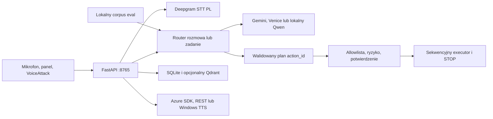

# VoiceLoop — opis portfolio

## W skrócie

VoiceLoop to lokalny asystent głosowy dla Windows, zaprojektowany przede
wszystkim dla języka polskiego. Rdzeń FastAPI rozdziela rozmowę od zadań,
przyjmuje wyłącznie typowane plany z `action_id`, egzekwuje poziomy ryzyka i
potrafi natychmiast zatrzymać model, syntezę mowy oraz wykonywaną akcję.

Najważniejsza wartość projektu nie polega na liczbie integracji, ale na
połączeniu trzech tematów:

1. bezpiecznego wykonywania poleceń generowanych przez model;
2. obsługi rozmowy głosowej z barge-in i polskim STT;
3. mierzalnej jakości przez lokalny korpus, zamrożony holdout i testy regresji.

Repozytorium pozostaje prywatne. Ten dokument opisuje wyłącznie funkcje możliwe
do obrony kodem, testami lub kontrolowanym demo.

## Architektura



Model nie przekazuje dowolnego polecenia powłoki. Każda wykonywalna operacja
musi istnieć w lokalnym katalogu możliwości, przejść walidację argumentów oraz
politykę ryzyka.

## Co jest zweryfikowane

- Lokalny panel, REST API i chroniony tokenem strumień zdarzeń.
- Rozmowa głosowa z sesją, przerwaniem TTS, ochroną przed echem i ponownym
  uzbrajaniem mikrofonu.
- Deterministyczne komendy VoiceAttack oraz naturalne polecenia planowane do
  typowanych akcji.
- SQLite jako trwały stan operacyjny; Qdrant i Screenpipe jako opcjonalne
  komponenty lokalnej pamięci.
- Pipeline voice eval: inwentaryzacja źródeł, hashe, deduplikacja, split
  development/holdout, ręczne adnotacje i metryki.
- Bezpieczne uzupełnianie development własnymi fragmentami mikrofonu ze spotkań,
  bez importowania kanału wyjściowego i bez zmiany zamrożonego holdoutu.
- `545 passed, 1 skipped` w pełnym przebiegu; pomijany jest tylko prywatny
  replay bez lokalnych transkryptów. Wynik kontroluje również workflow CI.

## Decyzje inżynierskie

### Bezpieczeństwo wykonania

- LLM zwraca schemat, a nie kod.
- Akcje mają statyczne identyfikatory i walidowane argumenty.
- Operacje wysokiego ryzyka wymagają jawnego potwierdzenia.
- Executor działa sekwencyjnie, a `request_id` ogranicza podwójne wykonanie.
- STOP omija planery i natychmiast anuluje aktywne elementy pętli.

### Prywatność

- API i narzędzia nagraniowe wiążą się wyłącznie z loopback.
- Health oraz SSE wymagają lokalnego tokenu.
- Klucze Gemini i Hume trafiają do nagłówków, nie do adresów URL.
- `data/`, `.env` i logi runtime nie są wersjonowane.
- Narzędzia `holding-commands` i `calibration-phrases` zapisują próbki lokalnie
  i nie wysyłają audio do usług zewnętrznych.

Screenpipe może przechwytywać szeroki kontekst komputera. Nie jest uruchamiany
w demo portfolio, a dane Screenpipe, spotkań i prywatnego korpusu nie są częścią
repozytorium ani materiałów prezentacyjnych.

### Ewaluacja zamiast ręcznego „wydaje się działać”

Korpus głosowy rozdziela development od zamrożonego holdoutu. Próbki mają
proweniencję, hashe audio, role mówcy i ręczne adnotacje. Nowa komenda
`prepare-meeting-voice` bierze wyłącznie pliki `input-microphone-*.wav`, buduje
kandydatów w katalogu tymczasowym, sprawdza niezmienność holdoutu, wykonuje
backup i dopiero wtedy publikuje artefakty.

## Status Hume

Kod zawiera eksperymentalny klient analizy prozodii Hume i testy parsera
odpowiedzi. Funkcja jest domyślnie wyłączona. Nie została zweryfikowana w demo
end-to-end i nie jest przedstawiana jako działająca funkcja produktu. Jej
włączenie oznaczałoby wysyłanie fragmentów audio spotkania do chmury Hume.

## Kontrolowane demo

Demo portfolio nie wymaga Screenpipe, Qdrant, n8n ani Hume.

1. Skopiuj `listener/.env.example` do lokalnego `listener/.env` i skonfiguruj
   tylko wybrane zależności. Nie pokazuj ani nie nagrywaj wartości sekretów.
2. Uruchom rdzeń przez `scripts/start-core.bat`.
3. Otwórz `http://127.0.0.1:8765`.
4. Pokaż chroniony health, katalog możliwości i bezpieczną komendę `voice_test`.
5. Pokaż plan wymagający potwierdzenia oraz natychmiastowy STOP.
6. Uruchom `scripts/test-loop.ps1`.
7. Zakończ wynikiem Ruff i pytest z CI.

Opcjonalne rozszerzenie demo to lokalny panel kalibracyjny:

```powershell
python .\scripts\calibration-phrases\server.py
```

## Świadome ograniczenia

- Projekt jest przeznaczony dla Windows i ma wysoki próg pełnej reprodukcji.
- Zewnętrzne STT, LLM i TTS wymagają kluczy oraz mogą generować koszt.
- Diaryzacja odróżnia mówców, ale nie jest biometrią właściciela głosu.
- Integracje n8n oraz Hume są opcjonalne i domyślnie wyłączone.
- Brak publicznej licencji; kod nie jest obecnie projektem open source.

## Werdykt wdrożeniowy zmian

- **KEEP:** chronione API, voice eval, atomowe przygotowanie nagrań spotkań,
  lokalne panele nagrywania fraz.
- **KEEP AS OPTIONAL:** Screenpipe, Qdrant, n8n, dostawcy chmurowi.
- **EXPERIMENTAL:** Hume EVI.
- **LOCAL ONLY / DROP FROM PORTFOLIO:** jednorazowy
  `scripts/staging-voice-eval/prepare.py` oraz wszystkie dane spotkań i nagrania.
