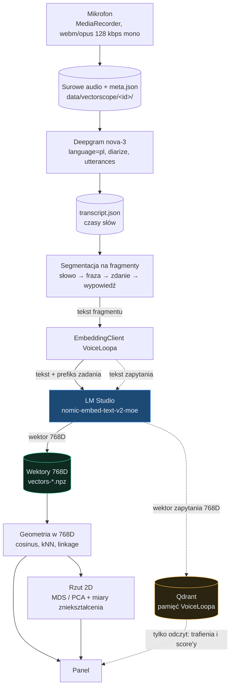

# Vectorscope

Laboratorium embeddingów wpięte w środowisko VoiceLoopa. Prowadzi nagranie przez
transkrypcję i wektoryzację aż do mapy podobieństw, a przy okazji pozwala
zajrzeć pamięci VoiceLoopa na ręce.

**Czym jest:** przyrząd pomiarowy. Pokazuje, co model naprawdę robi z twoim
tekstem i czy progi ustawione w `settings.py` cokolwiek rozróżniają.

**Czym nie jest:** pamięcią VoiceLoopa. Vectorscope **tylko czyta** Qdranta.
Zapisu nie wykonuje — pamięć zapisuje asystent, panel ją obserwuje.

## Uruchomienie

```powershell
cd C:\Users\marci\VoiceLoop
.\listener\.venv\Scripts\python.exe -m vectorscope.app
```

Panel: <http://127.0.0.1:8770>. Nasłuchuje wyłącznie na pętli zwrotnej, a klucz
Deepgram nigdy nie trafia do przeglądarki — transkrypcja idzie przez backend.

Wymaga działającego LM Studio z modelem `text-embedding-nomic-embed-text-v2-moe`
na `http://127.0.0.1:1234`. Qdrant jest potrzebny wyłącznie w trybie
diagnostycznym.

## Przepływ

Rozdzielenie jest istotne: klient embeddingów wysyła do LM Studio **tekst**,
a dopiero LM Studio zwraca **wektor 768D**. Wektory są wejściem do geometrii,
nie wyjściem z klienta.



Linia przerywana to tryb diagnostyczny. Qdrant dostaje **gotowy wektor
zapytania**, nigdy surowego tekstu ani danych do zapisu.

## Model danych: fragment, nie „named vector"

Poziom segmentacji to ziarnistość tego samego znaczenia, a named vector to
osobna przestrzeń znaczeniowa. To dwie różne rzeczy i mieszanie ich dałoby pięć
kopii jednego wektora. Dlatego każdy fragment jest **osobnym punktem**:

```json
{
  "id": "20260824-085114-dded:s3",
  "level": "sentence",
  "text": "Boli go głowa od tygodnia.",
  "start_ms": 4300,
  "end_ms": 5800,
  "parent_id": "20260824-085114-dded:u1",
  "recording_id": "20260824-085114-dded",
  "speaker": 0,
  "word_count": 5
}
```

`parent_id` spina łańcuch słowo → fraza → zdanie → wypowiedź, więc z każdego
punktu można wejść wyżej i zobaczyć kontekst. W panelu ten łańcuch pokazuje się
po kliknięciu węzła, a linia przerywana na grafie to relacja rodzic–dziecko.

Reguła podziału (`vectorscope-segmentation-v1`):

| Poziom | Skąd się bierze |
| --- | --- |
| `utterance` | `utterances[]` z Deepgrama, a przy ich braku całość nagrania |
| `sentence` | podział na `.` `!` `?` `…` |
| `phrase` | pauza > 350 ms albo `,` `;` `:` `—` `–` albo 6 słów, minimum 2 słowa |
| `word` | token Deepgrama |

## Pięć osi pamięci VoiceLoopa

Qdrant to szafa z pięcioma podpisanymi szufladami — sam nie wytwarza ich
zawartości. W VoiceLoopie każda oś ma osobne źródło tekstu i to zostało
sprawdzone w kodzie: `BehaviorDigest.vector_documents()` buduje **inny dokument
dla każdej osi**, a `memory_query_documents()` — inny tekst zapytania.

| Oś | Waga | Skąd treść |
| --- | --- | --- |
| `semantic` | najwyższa | streszczenie i obserwacje |
| `topic` | | temat zdarzenia |
| `intent` | | intencja użytkownika |
| `decision` | | jawna decyzja lub następny krok |
| `person_context` | | kontekst osoby i relacji |

Panel pokazuje te osi **osobno oraz po fuzji RRF**, bo fuzja ukrywa, która
przestrzeń wciągnęła dany rekord.

### Znaleziona pułapka

`QdrantVectorStore.search()` wywołany z pojedynczym `query_embedding` zamiast
mapy `query_vectors` kopiuje ten sam wektor do wszystkich pięciu osi
(`qdrant_memory.py:392-396`):

```python
shared_vector = [float(value) for value in query_input]
normalized_query_vectors = {name: shared_vector for name in selected_names}
```

RRF scala wtedy pięć identycznych rankingów: wynik jest taki sam jak przy jednej
osi, a koszt pięciokrotny. Ścieżka asystenta przekazuje poprawną mapę, więc
produkcja jest zdrowa — ale to wywołanie jest legalne i nic przed nim nie
ostrzega. Panel wykrywa ten przypadek i wypisuje go wprost.

## Odtwarzalność

Bez zapisanych warunków eksperyment jest ładny, ale nie jest pomiarem. `meta.json`
trzyma wszystko, co wpływa na wynik:

| Pole | Po co |
| --- | --- |
| `experiment_id`, `created_at` | identyfikacja przebiegu |
| `vectorscope_version` | wersja panelu |
| `deepgram_params` | pełny zestaw parametrów żądania, nie tylko nazwa modelu |
| `transcript_hash` | `sha256` tekstu i czasów słów — wykrywa podmianę transkryptu |
| `segmentation_rule`, `segmentation_version` | reguła podziału na fragmenty |
| `embedding_runs` | model, wymiar, prefiks i liczba fragmentów każdego przebiegu |
| `vector_storage_policy` | wektory leżą surowe, L2 liczone dopiero przy cosinusie |
| `timings_ms` | czas każdego etapu: upload, transkrypcja, embedding, geometria |
| `errors` | co poszło nie tak i kiedy |

Wektory lądują w `vectors-<poziom>-<prefiks>.npz` razem z tekstami, nazwą modelu
i znacznikiem normalizacji. Cache jest ważny tylko dla dokładnie tych samych
tekstów w tej samej kolejności.

## Co jest prawdą, a co ilustracją

To rozróżnienie jest w panelu wymuszone, nie sugerowane:

- **Prawda** — cosinus, kNN i dendrogram liczone w pełnych 768 wymiarach.
  Krawędź w grafie niesie informację.
- **Ilustracja** — MDS i PCA. Każdy rzut 2D spłaszcza 768 wymiarów do dwóch,
  więc **zawsze** kłamie. Pozycja węzła nie niesie informacji.

Dlatego przy każdym rzucie stoją miary tego kłamstwa: trustworthiness (ile
sąsiadów z obrazka jest sąsiadami naprawdę), continuity (ile prawdziwych
sąsiadów przetrwało), stress Kruskala i diagram Sheparda. Wielkość punktu na
rzucie to udział sąsiedztwa, który przeżył spłaszczenie.

## Pomiar skali: dwie różne przestrzenie, jeden próg

Kotwice o znanej relacji pokazują, *co* znaczy dana wysokość cosinusa, ale nie
nadają się do orzekania, gdzie leży dno skali — to próba o liczności jeden.
Dno liczy `scale.py` na korpusie ośmiu rozłącznych dziedzin, traktując każdą
parę z różnych dziedzin jako niepowiązaną.

Rozstrzygające jest to, **którą przestrzeń się mierzy**. VoiceLoop porównuje
zapytanie (`search_query: `) z dokumentem (`search_document: `), więc operacyjny
cosinus jest międzyprefiksowy. Rozkład dokument–dokument leży zupełnie gdzie
indziej i próg ustawiony na jego podstawie byłby ustawiony na ślepo.

| Rozkład | Dno p50 | Dno p95 | Sygnał p50 | Rozstaw |
| --- | --- | --- | --- | --- |
| **operacyjny** (zapytanie → dokument), 2016 par | 0.164 | 0.273 | 0.245 | 0.082 |
| dokument–dokument z `search_document: `, 1008 par | 0.477 | 0.578 | 0.563 | 0.086 |

Ten sam tekst po obu stronach retrievalu daje tylko **0.775**, nie 1.000 —
prefiksy rozsuwają nawet identyczną treść.

Powyższe liczby opisują jednak **gołe zdania**, a VoiceLoop nigdy nie embeduje
gołych zdań. Obie strony owija w szablony, i dopiero pomiar na nich mówi coś
o realnej konfiguracji.

## Progi mierzone w ich własnej przestrzeni

To jest trzecia wersja tego rozdziału i warto wiedzieć dlaczego. Pierwsza
orzekała o dnie skali z jednej kotwiki. Druga poprawiła to na rozkład, ale
liczyła go na gołych zdaniach. Dopiero trzecia używa produkcyjnych funkcji
`memory_vector_documents` i `memory_query_documents`, więc mierzy to, co
naprawdę trafia do Qdranta. Dwa pierwsze wnioski były nieprawdziwe.

Kluczowy fakt konstrukcyjny: `vector_memory_min_score` jest stosowany do
**surowego cosinusa każdej osi osobno, przed fuzją RRF** — raz jako
`score_threshold` w zapytaniu Qdranta, drugi raz przy zbieraniu wyników
(`qdrant_memory.py`). Każda oś ma przy tym własny stały nagłówek po stronie
dokumentu i inny po stronie zapytania. Nagłówek działa jak prefiks: przesuwa
cały rozkład tej osi.

| Oś | Waga | Szum p50 | Sygnał p50 | Rozstaw |
| --- | --- | --- | --- | --- |
| semantic | 0.40 | 0.365 | 0.421 | 0.055 |
| topic | 0.20 | 0.352 | 0.422 | 0.070 |
| intent | 0.15 | 0.414 | 0.469 | 0.055 |
| decision | 0.15 | 0.443 | 0.503 | 0.060 |
| person_context | 0.10 | 0.368 | 0.416 | 0.049 |

Dwie rzeczy widać od razu:

- **Rozstaw między osiami (0.091) jest większy niż rozstaw sygnału i szumu
  wewnątrz najlepszej osi (0.070).** Pozycja punktu w skali mówi więc więcej
  o tym, którego nagłówka użyto, niż o tym, czy treść pasuje do pytania.
- Nagłówki *zmniejszają* rozdzielczość. Na gołych zdaniach rozstaw wynosił
  0.082, po owinięciu w szablony spada do 0.049–0.070.

Panel świadomie **nie orzeka** o `capability_match_min_score` ani
`screenpipe_related_history_min_score`: działają na innym korpusie i innych
szablonach, których nie zmierzono. Zgadywanie byłoby tu gorsze od milczenia.

Osobna obserwacja z kotwic: antonimy („wysoki" / „niski") dostają 0.721, wyżej
niż większość par niepowiązanych. Embedding łapie wymiar znaczeniowy, nie znak.

## Pomiar na żywej kolekcji (`live.py`)

Wszystko powyżej opiera się na korpusie napisanym na potrzeby pomiaru. To
wystarcza, żeby orzec o właściwościach *modelu*, ale nie o właściwościach *tej*
pamięci. `live.py` pyta kolekcję produkcyjną, wyłącznie odczytem.

Metoda nie potrzebuje etykiet: bierzemy treść zapisanych dokumentów, budujemy
z niej zapytania produkcyjną funkcją i odpytujemy Qdranta **bez progu**. Dla
każdego zapytania znamy jedną poprawną odpowiedź — punkt, z którego treść
pochodzi. Zapytanie wywiedzione z dokumentu jest łatwiejsze niż prawdziwe
pytanie, więc sygnał jest górnym oszacowaniem; rozkład szumu jest prawdziwy.

Kolekcja: 1204 punkty, 1090 z `screenpipe_behavior`, 113 z `screenpipe_activity`,
1 ręczny.

### Kolekcja jest mieszanką trzech generacji

| Punktów | Schemat | Profil wektorów |
| --- | --- | --- |
| 611 | brak | brak |
| 338 | brak | `three_vectors_core` |
| 141 | `memory-documents-v2` | `dynamic_named_subset_v2` |
| 113 | `memory-documents-v2` | `legacy_semantic_only_v2` |

Obecnym schematem zwektoryzowano **12% zbioru**. Stąd nierówne pokrycie osi:

| Oś | Waga | Punktów | Pokrycie |
| --- | --- | --- | --- |
| semantic | 0.40 | 1204 | 100% |
| topic | 0.20 | 753 | 63% |
| intent | 0.15 | 1091 | 91% |
| decision | 0.15 | 668 | 55% |
| person_context | 0.10 | 1090 | 91% |

113 punktów ma **tylko** `semantic`, więc żadna inna oś nie może ich znaleźć.
To nie przypadek brzegowy, to niemal połowa zbioru — i stąd poprawka
normalizacji RRF oraz pole `coverage` w dowodach wyszukiwania.

### Rozkłady per oś, bez progu

| Oś | Szum p50 | Szum p95 | Szum max | Sygnał p50 | Ranga 1 |
| --- | --- | --- | --- | --- | --- |
| semantic | 0.611 | 0.936 | 0.944 | 0.826 | 50% |
| topic | 0.567 | 0.649 | 0.808 | 0.702 | 36% |
| intent | 0.646 | 0.867 | 0.878 | 0.849 | 56% |
| decision | 0.631 | 0.912 | 0.918 | 0.882 | 17% |
| person_context | 0.647 | 0.884 | 0.894 | 0.846 | 36% |

- Najniższy cosinus na realnych danych: **0.441**. Próg `0.15` przepuszczał 100%
  szumu w każdej osi. Nie odrzucał niczego i nie mógł.
- Mediany szumu rozjeżdżają się o 0.080 między osiami, więc jedna liczba progu
  znaczyłaby w każdej osi co innego.
- Kolumna „ranga 1" wygląda katastrofalnie: dokument źródłowy wychodzi na
  pierwsze miejsce w 17–56% przypadków, mimo że zapytanie pochodzi wprost z jego
  treści. Wyjaśnienie jest niżej i nie dotyczy wyszukiwania.

### 48% kolekcji to nadmiarowe kopie

Deduplikacja Screenpipe wektoryzowała surową treść jako `search_query`,
a porównywała ją z dokumentem zapisanym jako `search_document` wraz z nagłówkiem
szablonu semantycznego. Pomiar na 120 punktach obecnego schematu, gdzie zapisany
dokument da się odtworzyć dokładnie:

| Wariant | min | p50 | max | ≥ 0.92 |
| --- | --- | --- | --- | --- |
| dokument + szablon (jak zapis) | 1.000 | 1.000 | 1.000 | 100% |
| **zapytanie + sama treść (produkcja)** | 0.669 | 0.801 | **0.898** | **0%** |
| dokument + sama treść | 0.682 | 0.878 | 0.936 | 6% |
| zapytanie + szablon | 0.940 | 0.969 | 0.984 | 100% |

Tekst **identyczny bajt w bajt** osiągał w wariancie produkcyjnym najwyżej
0.898 przy progu 0.92. Bramka nie mogła zadziałać nigdy. Skutek:

- 71 grup punktów niemal identycznych (cosinus ≥ 0.999), największa liczy **146**
- 594 z 1090 punktów ma bliźniaka, czyli **523 punkty to nadmiarowe kopie (48%)**

To wyjaśnia kolumnę „ranga 1": poprawna odpowiedź konkurowała z własnymi
bliźniakami. Wyszukiwanie działało — dane były zepsute.

Nowy próg wyznaczono z rozkładu. Po zwinięciu grup ≥ 0.999 do reprezentantów
zostaje 567 różnych dokumentów; ich pary mają p50 = 0.552, p99 = 0.874,
p99.9 = 0.992. Próg **0.97** jest więc osiągalny dla duplikatu (identyczny tekst
= 1.000) i leży daleko nad rozkładem treści nowych.

Ważne, gdzie ten próg wolno przyłożyć. Przed digestem mamy surowy OCR, a w
Qdrancie leży podsumowanie modelu owinięte w szablon — to dwa różne rodzaje
tekstu i dla tej pary żaden próg nie jest skalibrowany. Dlatego deduplikacja jest
dwuetapowa:

1. **Przed digestem: sam odcisk treści.** Darmowy, bez wektorów, łapie kubełek
   powtórzony bajt w bajt — czyli dokładnie to, co zapchało kolekcję.
2. **Po digeście: porównanie semantyczne gotowym wektorem.** Używa tego samego
   wektora `semantic`, którym punkt zostałby zapisany, więc obie strony leżą
   w identycznej przestrzeni i nie ma dodatkowego kosztu embeddingu. Dopiero
   tutaj 0.97 znaczy to, co zmierzono.

Etap semantyczny przed digestem świadomie usunięto. Próg dla pary
„surowy OCR ↔ podsumowanie" byłby zgadnięty, a to dokładnie ten błąd
unieruchomił poprzednią wersję.

## Geometria prefiksów (`prefix_check.py`)

Karta modelu wymaga `search_query: ` przed pytaniami i `search_document: ` przed
dokumentami. Stara ścieżka Screenpipe zapisuje dokumenty bez prefiksu.

Ten moduł mierzy wyłącznie geometrię. Wcześniej liczył jeszcze trafienie
w pierwszym wyniku i MRR na 24 ręcznie napisanych parach — mikro-benchmark,
którego wnioski sam musiał opatrywać ostrzeżeniem, że różnica jednej sondy to
szum. Pytania o trafność mają teraz właściwe miejsce w `live.py`, na prawdziwych
wektorach.

Na 48 zdaniach z 8 dziedzin (1128 par):

| Konwencja | Ta sama dziedzina | Różne dziedziny | Zakres użyteczny | Dno (p95) |
| --- | --- | --- | --- | --- |
| `search_document` | 0.563 | 0.477 | 0.085 | 0.578 |
| `search_query` | 0.252 | 0.167 | 0.085 | 0.279 |
| bez prefiksu | 0.245 | 0.143 | 0.102 | 0.270 |

- **Prefiks przesuwa chmurę, nie rozsuwa jej.** Dno rośnie o 0.334
  (0.143 → 0.477), a zakres użyteczny zostaje ten sam (0.085 vs 0.102). Prefiks
  dokłada wszystkim wektorom wspólny kierunek i nic więcej.
- **Zakres użyteczny to 0.085.** Cały odstęp między „ta sama dziedzina" i „różne
  dziedziny" mieści się w ośmiu setnych. Na tym modelu bezwzględny próg cosinusa
  jest narzędziem tępym, niezależnie od wartości.
- Ten sam tekst jako dokument i jako zapytanie: **0.775**, nie 1.000. To cena
  pomyłki prefiksu i dokładnie ona unieruchomiła deduplikację.
- Tekst bez prefiksu leży blisko `search_query` (0.946). Stara ścieżka de facto
  zapisuje dokumenty tak, jakby były zapytaniami — stąd jej pozornie wyższe
  cosinusy: porównuje zapytanie z zapytaniem.

Kontrola spójności: dno `search_document` zmierzone na korpusie (0.578) zgadza
się z medianami szumu na żywej kolekcji (0.567–0.647). Dwa niezależne pomiary
wskazują to samo miejsce skali.

### Wniosek o bramce przed fuzją

RRF łączy **rangi** właśnie po to, żeby nie zależeć od wartości bezwzględnych.
Bramka na bezwzględnym cosinusie *przed* fuzją działa wbrew tej konstrukcji: może
wyciąć oś, w której dokument miał rangę pierwszą, tylko dlatego że ta oś ma
niżej położony rozkład. Przy zakresie użytecznym 0.085 i rozjeździe osi 0.080
kalibracja jednej liczby na pięć przestrzeni jest niewykonalna.

Decyzja: `vector_memory_min_score` schodzi do **0.0**. Na tych danych to zmiana
bez żadnego skutku (minimum obserwowane 0.441), ale kod przestaje obiecywać
bramkę, której nie ma. Progi absolutne zostają tam, gdzie są skalibrowane — przy
deduplikacji. Dowody wyszukiwania dostają pole `gate` z najniższym przepuszczonym
cosinusem, żeby skutek dowolnej przyszłej wartości był widoczny w danych zamiast
zgadywany.

## Znane problemy środowiska

- `OpenAICompatibleEmbeddingClient.health()` zwraca `True` przy całkowicie
  wyłączonym LM Studio, bo `resolve_model()` oddaje nazwę modelu z konfiguracji
  bez pytania serwera. Vectorscope nie ufa tej metodzie i sprawdza dostępność
  realnym żądaniem embeddingu.
- W środowisku nie ma `scipy` ani `scikit-learn` — polityka kontroli aplikacji
  Windows blokuje ładowanie ich bibliotek DLL. Cała geometria jest napisana
  w czystym NumPy i zwalidowana skryptem `_validate_geometry.py`.

## Pliki

| Moduł | Rola |
| --- | --- |
| `app.py` | FastAPI, port 8770, API i serwowanie panelu |
| `fragments.py` | podział na fragmenty i łańcuch `parent_id` |
| `store.py` | układ na dysku, `meta.json`, cache wektorów |
| `transcribe.py` | Deepgram nova-3 |
| `embed.py` | wektoryzacja z jawnym prefiksem i kontrolą indeksów |
| `geometry.py` | cosinus, kNN, UPGMA, MDS, PCA, miary zniekształcenia |
| `analysis.py` | orkiestracja całej analizy |
| `anchors.py` | kotwice skali |
| `diagnostics.py` | pięć osi pamięci VoiceLoopa i fuzja RRF |
| `scale.py` | dno skali i osiągalność progów na korpusie |
| `live.py` | pomiar na kolekcji produkcyjnej, tylko odczyt |
| `prefix_check.py` | geometria prefiksów zadania |
| `_validate_geometry.py` | walidacja matematyki |
| `_smoke.py` | test całej drogi na syntetycznym transkrypcie |
