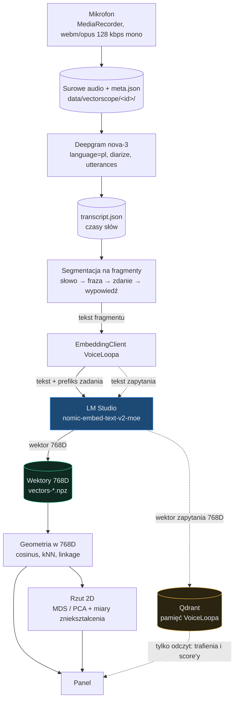

# Vectorscope

Laboratorium embeddingów wpięte w środowisko VoiceLoopa. Prowadzi nagranie przez
transkrypcję i wektoryzację aż do mapy podobieństw, a przy okazji pozwala
zajrzeć pamięci VoiceLoopa na ręce.

**Czym jest:** przyrząd pomiarowy. Pokazuje, co model naprawdę robi z twoim
tekstem i czy progi ustawione w `settings.py` cokolwiek rozróżniają.

**Czym nie jest:** pamięcią VoiceLoopa. Vectorscope **tylko czyta** Qdranta.
Zapisu nie wykonuje — pamięć zapisuje asystent, panel ją obserwuje.

## Uruchomienie

```powershell
cd C:\Users\marci\VoiceLoop
.\listener\.venv\Scripts\python.exe -m vectorscope.app
```

Panel: <http://127.0.0.1:8770>. Nasłuchuje wyłącznie na pętli zwrotnej, a klucz
Deepgram nigdy nie trafia do przeglądarki — transkrypcja idzie przez backend.

Wymaga działającego LM Studio z modelem `text-embedding-nomic-embed-text-v2-moe`
na `http://127.0.0.1:1234`. Qdrant jest potrzebny wyłącznie w trybie
diagnostycznym.

## Przepływ

Rozdzielenie jest istotne: klient embeddingów wysyła do LM Studio **tekst**,
a dopiero LM Studio zwraca **wektor 768D**. Wektory są wejściem do geometrii,
nie wyjściem z klienta.



Linia przerywana to tryb diagnostyczny. Qdrant dostaje **gotowy wektor
zapytania**, nigdy surowego tekstu ani danych do zapisu.

## Model danych: fragment, nie „named vector"

Poziom segmentacji to ziarnistość tego samego znaczenia, a named vector to
osobna przestrzeń znaczeniowa. To dwie różne rzeczy i mieszanie ich dałoby pięć
kopii jednego wektora. Dlatego każdy fragment jest **osobnym punktem**:

```json
{
  "id": "20260824-085114-dded:s3",
  "level": "sentence",
  "text": "Boli go głowa od tygodnia.",
  "start_ms": 4300,
  "end_ms": 5800,
  "parent_id": "20260824-085114-dded:u1",
  "recording_id": "20260824-085114-dded",
  "speaker": 0,
  "word_count": 5
}
```

`parent_id` spina łańcuch słowo → fraza → zdanie → wypowiedź, więc z każdego
punktu można wejść wyżej i zobaczyć kontekst. W panelu ten łańcuch pokazuje się
po kliknięciu węzła, a linia przerywana na grafie to relacja rodzic–dziecko.

Reguła podziału (`vectorscope-segmentation-v1`):

| Poziom | Skąd się bierze |
| --- | --- |
| `utterance` | `utterances[]` z Deepgrama, a przy ich braku całość nagrania |
| `sentence` | podział na `.` `!` `?` `…` |
| `phrase` | pauza > 350 ms albo `,` `;` `:` `—` `–` albo 6 słów, minimum 2 słowa |
| `word` | token Deepgrama |

## Pięć osi pamięci VoiceLoopa

Qdrant to szafa z pięcioma podpisanymi szufladami — sam nie wytwarza ich
zawartości. W VoiceLoopie każda oś ma osobne źródło tekstu i to zostało
sprawdzone w kodzie: `BehaviorDigest.vector_documents()` buduje **inny dokument
dla każdej osi**, a `memory_query_documents()` — inny tekst zapytania.

| Oś | Waga | Skąd treść |
| --- | --- | --- |
| `semantic` | najwyższa | streszczenie i obserwacje |
| `topic` | | temat zdarzenia |
| `intent` | | intencja użytkownika |
| `decision` | | jawna decyzja lub następny krok |
| `person_context` | | kontekst osoby i relacji |

Panel pokazuje te osi **osobno oraz po fuzji RRF**, bo fuzja ukrywa, która
przestrzeń wciągnęła dany rekord.

### Znaleziona pułapka

`QdrantVectorStore.search()` wywołany z pojedynczym `query_embedding` zamiast
mapy `query_vectors` kopiuje ten sam wektor do wszystkich pięciu osi
(`qdrant_memory.py:392-396`):

```python
shared_vector = [float(value) for value in query_input]
normalized_query_vectors = {name: shared_vector for name in selected_names}
```

RRF scala wtedy pięć identycznych rankingów: wynik jest taki sam jak przy jednej
osi, a koszt pięciokrotny. Ścieżka asystenta przekazuje poprawną mapę, więc
produkcja jest zdrowa — ale to wywołanie jest legalne i nic przed nim nie
ostrzega. Panel wykrywa ten przypadek i wypisuje go wprost.

## Odtwarzalność

Bez zapisanych warunków eksperyment jest ładny, ale nie jest pomiarem. `meta.json`
trzyma wszystko, co wpływa na wynik:

| Pole | Po co |
| --- | --- |
| `experiment_id`, `created_at` | identyfikacja przebiegu |
| `vectorscope_version` | wersja panelu |
| `deepgram_params` | pełny zestaw parametrów żądania, nie tylko nazwa modelu |
| `transcript_hash` | `sha256` tekstu i czasów słów — wykrywa podmianę transkryptu |
| `segmentation_rule`, `segmentation_version` | reguła podziału na fragmenty |
| `embedding_runs` | model, wymiar, prefiks i liczba fragmentów każdego przebiegu |
| `vector_storage_policy` | wektory leżą surowe, L2 liczone dopiero przy cosinusie |
| `timings_ms` | czas każdego etapu: upload, transkrypcja, embedding, geometria |
| `errors` | co poszło nie tak i kiedy |

Wektory lądują w `vectors-<poziom>-<prefiks>.npz` razem z tekstami, nazwą modelu
i znacznikiem normalizacji. Cache jest ważny tylko dla dokładnie tych samych
tekstów w tej samej kolejności.

## Co jest prawdą, a co ilustracją

To rozróżnienie jest w panelu wymuszone, nie sugerowane:

- **Prawda** — cosinus, kNN i dendrogram liczone w pełnych 768 wymiarach.
  Krawędź w grafie niesie informację.
- **Ilustracja** — MDS i PCA. Każdy rzut 2D spłaszcza 768 wymiarów do dwóch,
  więc **zawsze** kłamie. Pozycja węzła nie niesie informacji.

Dlatego przy każdym rzucie stoją miary tego kłamstwa: trustworthiness (ile
sąsiadów z obrazka jest sąsiadami naprawdę), continuity (ile prawdziwych
sąsiadów przetrwało), stress Kruskala i diagram Sheparda. Wielkość punktu na
rzucie to udział sąsiedztwa, który przeżył spłaszczenie.

## Pomiar skali: dwie różne przestrzenie, jeden próg

Kotwice o znanej relacji pokazują, *co* znaczy dana wysokość cosinusa, ale nie
nadają się do orzekania, gdzie leży dno skali — to próba o liczności jeden.
Dno liczy `scale.py` na korpusie ośmiu rozłącznych dziedzin, traktując każdą
parę z różnych dziedzin jako niepowiązaną.

Rozstrzygające jest to, **którą przestrzeń się mierzy**. VoiceLoop porównuje
zapytanie (`search_query: `) z dokumentem (`search_document: `), więc operacyjny
cosinus jest międzyprefiksowy. Rozkład dokument–dokument leży zupełnie gdzie
indziej i próg ustawiony na jego podstawie byłby ustawiony na ślepo.

| Rozkład | Dno p50 | Dno p95 | Sygnał p50 | Rozstaw |
| --- | --- | --- | --- | --- |
| **operacyjny** (zapytanie → dokument), 2016 par | 0.164 | 0.273 | 0.245 | 0.082 |
| dokument–dokument z `search_document: `, 1008 par | 0.477 | 0.578 | 0.563 | 0.086 |

Ten sam tekst po obu stronach retrievalu daje tylko **0.775**, nie 1.000 —
prefiksy rozsuwają nawet identyczną treść.

Wnioski dla konfiguracji:

- `vector_memory_min_score = 0.15` **nie jest martwy**. Leży mniej więcej na
  medianie szumu (0.164), więc odrzuca około połowy treści bez związku.
- Prawdziwy problem jest inny i poważniejszy: **sygnał i szum niemal się
  pokrywają**. Piąty percentyl par powiązanych (0.146) leży *poniżej* mediany
  par niepowiązanych. Podniesienie progu do 95. percentyla szumu (0.273)
  wycięłoby **64%** par faktycznie powiązanych.
- Na tym modelu żaden pojedynczy próg cosinusa nie rozdzieli sygnału od szumu.
  Sensowniejsze jest ograniczanie liczby wyników i sortowanie niż odcinanie
  wartością.
- `screenpipe_duplicate_min_score = 0.92` leży wysoko ponad szumem przestrzeni
  dokument–dokument (max 0.672), więc jako filtr duplikatów jest ustawiony
  sensownie.

Osobna obserwacja z kotwic: antonimy („wysoki" / „niski") dostają 0.721, wyżej
niż większość par niepowiązanych. Embedding łapie wymiar znaczeniowy, nie znak.

## Niespójność prefiksów: mierzona rankingiem, nie cosinusem

Karta modelu wymaga `search_query: ` przed pytaniami i `search_document: ` przed
dokumentami. Stara ścieżka Screenpipe zapisuje dokumenty bez prefiksu.

`prefix_check.py` porównuje konwencje **trafieniem w pierwszym wyniku**, a nie
średnim cosinusem, i to jest istotne: prefiks przesuwa całą chmurę wektorów, więc
konwencja o niższych cosinusach może mieć lepszy retrieval. Pierwsza wersja tego
modułu porównywała średnie i wyciągnęła z tego fałszywy wniosek.

Na 24 sondach wszystkie cztery konwencje trafiają 22–23 razy na 24. Różnica
jednej sondy to szum, więc **niespójność prefiksów nie psuje tu rankingu**.
Psuje natomiast dwie inne rzeczy:

- Ten sam tekst pod dwoma prefiksami ma cosinus 0.835, nie 1.000 — wektory nie
  są wymienne, więc porównywanie ich wprost jest błędem.
- Tekst bez prefiksu leży bardzo blisko wariantu `search_query: ` (cosinus
  0.968). Stara ścieżka de facto zapisuje dokumenty tak, jakby były zapytaniami,
  i stąd biorą się jej pozornie wyższe cosinusy — porównuje zapytanie
  z zapytaniem.
- Prefiks `search_document: ` podnosi wzajemne podobieństwo niepowiązanych
  dokumentów z 0.302 do 0.574, czyli dokłada wspólny kierunek i ściska zakres.

## Znane problemy środowiska

- `OpenAICompatibleEmbeddingClient.health()` zwraca `True` przy całkowicie
  wyłączonym LM Studio, bo `resolve_model()` oddaje nazwę modelu z konfiguracji
  bez pytania serwera. Vectorscope nie ufa tej metodzie i sprawdza dostępność
  realnym żądaniem embeddingu.
- W środowisku nie ma `scipy` ani `scikit-learn` — polityka kontroli aplikacji
  Windows blokuje ładowanie ich bibliotek DLL. Cała geometria jest napisana
  w czystym NumPy i zwalidowana skryptem `_validate_geometry.py`.

## Pliki

| Moduł | Rola |
| --- | --- |
| `app.py` | FastAPI, port 8770, API i serwowanie panelu |
| `fragments.py` | podział na fragmenty i łańcuch `parent_id` |
| `store.py` | układ na dysku, `meta.json`, cache wektorów |
| `transcribe.py` | Deepgram nova-3 |
| `embed.py` | wektoryzacja z jawnym prefiksem i kontrolą indeksów |
| `geometry.py` | cosinus, kNN, UPGMA, MDS, PCA, miary zniekształcenia |
| `analysis.py` | orkiestracja całej analizy |
| `anchors.py` | kotwice skali |
| `diagnostics.py` | pięć osi pamięci VoiceLoopa i fuzja RRF |
| `prefix_check.py` | pomiar skutku niespójnych prefiksów |
| `_validate_geometry.py` | walidacja matematyki |
| `_smoke.py` | test całej drogi na syntetycznym transkrypcie |
